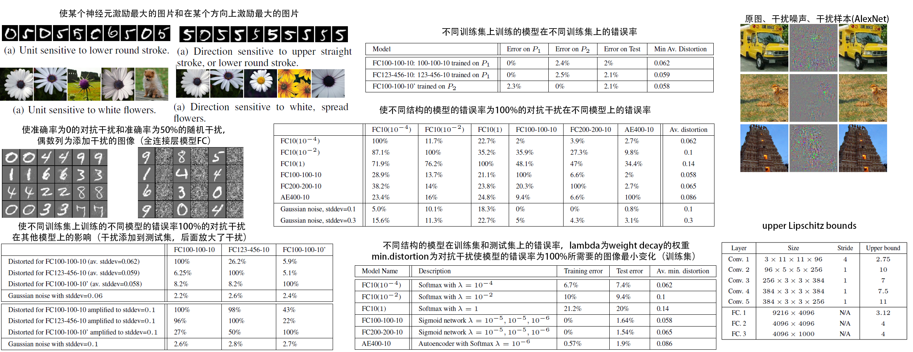
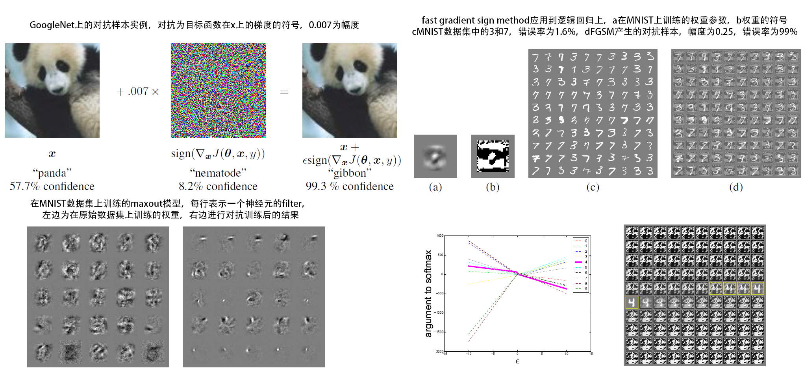
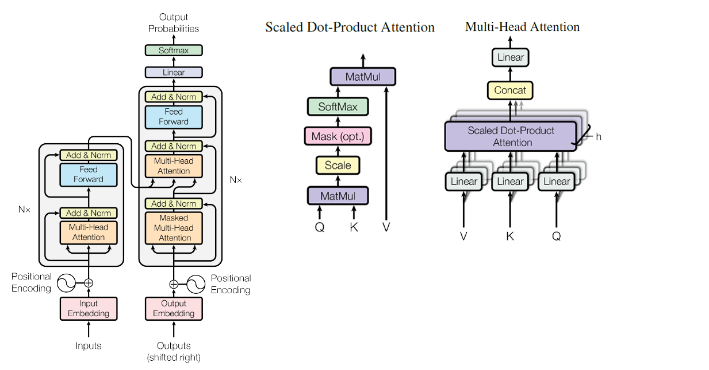

# 卷积CNN

## [2014-Very deep convolutional networks for large-scale image recognition](https://arxiv.org/abs/1409.1556)

引用数：44780	来源：ICLR（ International Conference on Learning Representations）

+ the effect of the convolutional network depth on its accuracy,using an architecture with very small (3×3) convolution filters,
+ 配置：fixed-size 224 × 224 RGB image，subtracting the mean RGB value，small receptive field: 3 × 3 ，The convolution stride is fixed to 1 pixel，the padding is 1 pixel，Max-pooling with a 2 × 2 pixel window, with stride 2。
+ It is easy to see that a stack of two 3×3 conv. layers (without spatial pooling in between) has an effective receptive field of 5×5；three such layers have a 7 × 7 effective receptive field；好处：more non-linear rectification layers，decrease the number of parameters。

# 反事实推理

## [2001-Direct and indirect effects](https://arxiv.org/abs/1301.2300)

引用数：1163	来源：In Proceedings of the 17th Conference on uncertainty in artiïňĄcial intelligencea

The direct effect of one event on another can be defined and measured by holding constant all intermediate variables between the two。

+ presents a new way of defining the effect transmitted through a restricted set of paths, without controlling variables on the remaining paths
+ **total effect**：assess in a controlled experiment。x is random,estimate the distribution of y。
+ **direct effect**：quantify an influence that is not mediated by other variables。set the intermedia fixed 
+ **Indirect effects**：
+ **prescriptive** conceptualization：holding mediate variables fixed at some predetermined level；controlled direct effect
+ **descriptive** conceptualization：hold the mediate variables fixed at whatever currently level is；natural direct effect；need knowledge。

## [2020-Counterfactual VQA: A Cause-Effect Look at Language Bias](https://arxiv.org/abs/2006.04315)

引用数：1	来源：arXiv preprint arXiv

+ 问题：tend to exploit the language bias for answering，machines may merely focus on the question rather than the visual content。the language bias，visual priming bias。

+ 方法：bias can be overcome by the comparison between factual and counterfactual outcomes。

  + The reference values of V and Q are denoted as v* and q* respectively

  + the total effect(TE) of v and q on a can be written as：$TE=Y_{v,q}-Y_{v*,q*}=Z_{v,q,k}-Z_{v*,q*,k*}$；
  + counterfactual VQA：where Q is set to q and K would attain the value k* when Q had been q* and V had been $v^*$。$NDE=Z_{v*,q,k*}-Z_{v*,q*,k*}$
  + removing language bias can be realized by reducing NDE from TE：$TE-NDE=Z_{v,q,k}-Z_{v*,q,k*}$。
  + define the reference value as blocking the signal from vision or language，i.e., v or q is not given。
  + define the outcome of void input as the same constant for all the logits

# 图片问答

learn to answer natural language questions from images.

## [2016-Stacked attention networks for image question answering](http://openaccess.thecvf.com/content_cvpr_2016/html/Yang_Stacked_Attention_Networks_CVPR_2016_paper.html) [代码](https://github.com/zcyang/imageqa-san)

引用数：1110	来源：Proceedings of the IEEE conference on computer vision and pattern recognition

use semantic representation of a question as query to search for the regions in an image that are related to the answer.

+ 以前方法：extract a global image feature vector，encode the corresponding question as a feature vector，combine them to infer the answer。requires multi-step reasoning。缺点：fail to give precise answers。
+ 方法：stacked attention model, which locates, via **multi-step reasoning**, the image regions that are relevant to the question for answer prediction。
+ Accordingly, each feature vector in $f_I$ corresponds to a 32×32 pixel region of the input images；refined query encodes both question information and the visual information that is relevant to the potential answer。use the refined query to infer the answer。
+ 实验：DAQUAR-ALL、COCO-QA（Object, Number, Color, and Location）、VQA；answers are single words。formulate image QA as a **classification problem** since most of answers are single words。

# 图神经网络

## [1999-The PageRank citation ranking: Bringing order to the web.](http://ilpubs.stanford.edu:8090/422)

引用数：14076	来源： [R] Stanford InfoLab

## [2015-Spatial transformer networks](http://papers.nips.cc/paper/5854-spatial-transformer-networks)

引用数：3390	来源：nips

+ 问题：lack of ability to be spatially invariant to the input data

## [2019-Disentangled graph convolutional networks](http://proceedings.mlr.press/v97/ma19a.html)

引用数：29	来源：International Conference on Machine Learning.

+ 问题：neglect the entanglement of the latent factors；we would like output to be composed of K independent components

## [2019-Heterogeneous graph attention network](https://dl.acm.org/doi/abs/10.1145/3308558.3313562)

引用数：132	来源：The World Wide Web Conference

+ 问题：it has not been fully considered in graph neural network for heterogeneous graph which contains different types of nodes and links.
+ 解决方法：first propose a novel heterogeneous graph neural network based on the **hierarchical attention**, including node-level and semantic-level attentions.
+ 定义：Heterogeneous Graph、Meta-path、Meta-path based Neighbors。
+ 步骤：
  + Node-level Attention：type-specific transformation matrix、self-attention、aggregate、multihead attention。
  + Semantic-level Attention：nonlinear transformation、similarity

## [2019-Graph transformer networks](http://papers.nips.cc/paper/9367-graph-transformer-networks)

引用数：28	来源：Advances in Neural Information Processing Systems.

+ learn meta-paths for given data and tasks and operate graph convolution on the learned meta-path graphs.
+ 

## [2020-A comprehensive survey on graph neural networks](https://ieeexplore.ieee.org/abstract/document/9046288/)

引用数：609	来源：

+ 差别：Network embedding aims at representing network nodes as low-dimensional vector representations；GNNs are deep learning models aiming at addressing graph-related tasks in an end-to-end manner。
+ 定义：$G=(V,E);v_i\in V,e_{ij}=(v_i,v_j)\in E;v邻域:N(v),邻接矩阵A,节点特征X;边特征X^e$。Spatial-Temporal Graph：node attributes change dynamically over time。
+ 任务：Node-level，Edge-level、Graph-level；Semi-supervised learning for node-level classification，Supervised learning for graph-level classification，Supervised learning for graph-level classification；
+ **recurrent graph neural networks**：aim to learn node representations with recurrent neural architectures。assume a node in a graph constantly exchanges information/message with its neighbors until a stable equilibrium
+ **convolutional graph neural networks**：The main idea is to generate a node v’s representation by aggregating its own features $x_v$ and neighbors’  features $x_u$, where $u\in N(v)$。
+ **graph autoencoders**：encode nodes/graphs into a latent vector space and reconstruct graph data from the encoded information.
+ **spatial-temporal graph neural networks**：aim to learn hidden patterns from spatial-temporal graphs，consider spatial dependency and temporal dependency at the same time.

# 对抗样本

## [2013-Intriguing properties of neural networks](https://arxiv.org/abs/1312.6199)

引用数：4963	来源：arXiv preprint arXiv 

+ **问题**：深度神经网络表达能力很强，但学到了是难以解释的有反直觉属性的办法，

  + <u>高层的单个神经元与他们之间的随机线性组合不具备区分性（神经元层面研究）</u>。以前认为单个神经元具有语义意义（使该神经元产生最大激励的**输入集**作为其语义，这假设了最后一个特征层里的神经元组成了一个可区分的基（自然基））。本文认为是激励的整个空间包含了语义信息：**一个随机的方向（随机基），在该方向上激励最大的图像，与在单个神经元激励最大的图像在语义上具有相似性**。

  + <u>深度神经网络学习的输入-输出映射在很大程度上是相当不连续的（模型层面研究）</u>。

+ 输入输出间的多层非线性映射没有优先编码非局部的信息，因为模型可能给输入空间中没有训练样本的区域赋低概率（这些区域可以是相同物体不同视角得到的图片，像素层面差别大，但应该共享一个标签）。

  + 如果编码局部信息，假设只要输入空间变化足够小，则会被模型正确分类，即输入空间的平滑性。

+ 但**给输入加上一定的难以识别的扰动会导致分类出错**（足够小的干扰），说明平滑假设并不成立。这样的输入称为**adversarial examples**，

  + 使用简单的优化程序，可以找到对抗样本，

+ **对抗样本具有很强的鲁棒性（对很多不同模型都会产生影响，如对不同模型，不同参数、结构的模型，不同训练集上的模型），对抗样本是普遍存在的。**

+ 对抗样本用来训练可以提升模型的泛化能力，如100-100-10的全连接层模型，使用weight decay的错误率为1.6%，dropout为1.3%，对抗样本为1.2%。

+ ？**形式描述**：$f:R^m \to \{1\dots k\}$为一个分类器，损失函数$loss_f:R^m\times\{1\dots k\}\to R^+$。给定$x$和对应的标签$l$；希望解决如下的box-constrained optimization problem：$\min ||r||_2 \ \atop subject \ to \begin{cases}f(x+r)=l \\ x+r\in [0,1]^m \end{cases}$。最小的r不一定唯一，由$D(x,l)$表示一个任意选取的一个$x+r$，有$D(x,f(x))=f(x)$，当$f(x)\neq l$时，即为我们期望的任务，计算D比较困难，用**box-constrained L-BFGS**近似D：执行线性搜索来找到最小的$c>0$,使得$\min c|r|+loss_f(x+r,l) \atop subject \ to \ x+r\in[0,1]^m$的最小$r$满足$f(x+r)=l$。

+ **分析**：模型可表示为：$\phi(x)=\phi_K(\phi_{K-1}(\dots\phi_1(x;W_1);\dots W_{k-1});W_K)$；假设每一层的upper Lipschitz constant为$L_k$，有$\forall_{x,r},||\phi_k(x,W_k)-\phi_k(x+r,W_k)||\leq L_k||r||$。则有$||\phi(x)-\phi(x+r)||\leq L||r||$，$L=\prod L_k$。

  + 对于$\rho(x)=\max(0,x)$，则$||\rho(x)-\rho(x+r)||\leq ||r||$恒成立，则$||\phi_k(x,W_k)-\phi_k(x+r,W_k)||\leq W_k||r||$。
  + 对于最大池化层：$||\phi_k(x)-\phi_k(x+r)||\leq ||r||$。
  + 对于contrast-normalization层：$\phi_k(x)=\frac{x}{(\epsilon+||x||^2)^{\gamma}}$，有$||\phi_k(x)-\phi_k(x+r)||\leq \epsilon^{-\gamma}||r||$。
  + 以上两者$L_k\leq 1$，所以可只考虑全连接层和卷积层，全连接层可取元素的最大值，卷积层范数$||W||= {sup\atop \xi\in[0,N\Delta^{-1})}||A(\xi)||$。

  输入加上微小的干扰，导致输出剧烈变化；通过控制上界，则可能改善模型泛化能力。**大的上界不会自动导致对抗样本的存在，但小的上界一定不会导致对抗样本的存在**。

+ 实验数据：

## [2014-Explaining and harnessing adversarial examples](https://arxiv.org/abs/1412.6572)

引用数：5096	来源：arXiv preprint arXiv 

+ **问题**：一些学习模型无法正确分类adversarial examples（对抗样本，给样本添加较小的糟糕的扰动），以前解释主要关注的是模型的非线性和过拟合。

+ 本文认为是因为模型的**linear nature**。据此设计了一种产生对抗样本的简单快速方法。使用该种方法可降低模型误差。并提供了设计好训练的线性模型和设计可对抗扰动的非线性模型间的**fundamental tension**（折中）。

+ **线性模型解释**：干扰输入$\widetilde x=x+\eta$，$||\eta||_{\infty}<\epsilon$（如果干扰$\eta$的每个元素都小于输入特征的精度，则分类器不会出错）；输出$w^T\widetilde x=w^Tx+w^T\eta$，定义$\eta=sign (w)$（sign为符号函数），在$\eta$最大范数`max-norm`限制下，则输出随加问题的维度而增加，但干扰不随维度增加。则通过**输入上的很多无穷小变化导致输出上较大的变化**。这也是产生对抗样本的最快方法。

+ **非线性模型解释**：神经网络由于太线性化了导致其无法抵抗干扰样本，如relu、sigmoid的线性部分，在模型参数$\theta$、输入$x$，标签$y$，损失函数$J(\theta,x,y)$；将损失函数线性化为当前$\theta$值，则在max-norm限制下获得最优干扰$\eta=\epsilon sign(\nabla_xJ(\theta,x,y))$，称为fast gradient sign method(FGSM)。

+ **线性模型的对抗训练VS权值衰减weight decay**：逻辑回归中，目标函数：$E_{x,y\sim P_{data}}\varsigma(-y(w^Tx+b))$，其中$\varsigma(z)=\log(1+exp(z))$。则在对抗样本上的训练，对应的对抗目标函数为：$E_{x,y\sim P_{data}}\varsigma(y(\epsilon||w||_1-w^Tx-b))$。不同于L1正则项（它加到损失函数上的）。在学的比较好时，惩罚项不再起作用，在欠拟合时，恶化欠拟合；而正则化不会。

+ **深度网络的对抗训练**：虽然神经网络能表示任意的函数，但训练算法不一定能找到这样的函数；使用FGSM的对抗目标函数进行训练是有效的正则方法。
  $$
  \widetilde J(\theta,x,y)=\alpha J(\theta,x,y)+(1-\alpha)J(\theta,x+\epsilon sign(\Delta_xJ(\theta,x,y)))\tag{1}
  $$
  持续更新对抗样本，使其对抗当前模型，将其用到有dropout的maxnet网络，错误率从0.94%降到0.84%；

  + 对抗训练出的模型对干扰样本也有一定的抵抗能力，且新的对抗样本生成方法比以前的对抗样本更具有干扰性。

+ 可以解释为主动学习，能够给输入空间中新的点打标签（人类是依据相近点复制标签）；也可认为寻找hard example（很容易影响分类的样本），

  + 在随机噪声样本上训练的模型对对抗样本仍然敏感。
  + 干扰添加到其他层导致的结果不相同。

+ 不同模型的能力：RBF网络$p(y=1|x)=exp((x-\mu)^T\beta(x-\mu))$，只能够自信地预测$\mu$附近存在正例，它对干扰样本不敏感。在MNIST上的对抗样本的错误率为55.4%，但置信度只有1.2%，纯洁样本中的置信度为60.6%。

+ 对抗样本的泛化能力的解释：模型的线性性

+ 实验数据：

# 对抗生成网络

## [2014-Generative adversarial nets](http://papers.nips.cc/paper/5423-generative-adversarial-nets)

引用数：21377	来源：Advances in neural information processing systems

+ **问题**：判别器很成功（如分类器），生成模型由于最大似然估计里棘手的概率计算不太成功。所以本文提出了一个可以绕过该问题的新生成模型（判别器判断样本来自生成模型还是训练数据，）。

+ **相关工作**：

  + 生成模型主要集中于概率分布函数的模型，然后使用最大似然估计进行训练（如deep Boltzmann machine）；
  + generative machines，Generative stochastic networks使用反向传播进行训练，
  + 本文基于$\lim_{\sigma\to 0}\nabla_xE_{\epsilon\sim N(0,\sigma^2I)}f(x+\epsilon)=\nabla_xf(x)$，进行反向传播梯度
  + variational autoencoders(VAEs)由一个可导生成网络和一个近似推理的识别网络。
  + 使用判别标准来训练生成模型，如Noise-contrastive estimation (NCE)。
  + 让两个神经网络竞赛，如predictability minimization。
  + 对抗样本，

+ **Adversarial nets**：本文的对抗建模框架可直接应用到MLP模型上，

  + 为了学习生成器在数据$x$上的分布$p_g$，在输入噪声变量$p_z(z)$上定义一个先验，用$G(z;\theta_g)$表示它到数据空间的映射；

  + 同时定义一个输出标量的MLP模型$D(x;\theta_d)$，表示数据$x$来自数据空间（样本空间）的概率。

  + 训练D使其能够尽可能地区分（给正确标签）训练样本和来自G的样本。相当于就值V(D,G)执行最大最小游戏。
    $$
    {\min\atop G}{\max\atop D}V(D,G)=E_{z\sim p_{data}(x)}[\log D(x)]+E_{z\sim p_z(z)}[\log(1-D(G(z)))] \tag{1}
    $$
    实际中，使用多次迭代的方法进行实现。即在k步的D优化和一步的G优化间进行迭代。早期时，G产生的数据很糟糕，D可以轻松地识别生成数据和原始数据，这时，用最大化$\log D(G(z))$来训练G，

+ **Theoretical Results**：

  + 全局最优解$p_g=p_{data}$。
  + 算法是收敛的。

+ 实验：MNIST, the Toronto Face Database(TFD) , CIFAR-10；生成器使用了ReLU和sigmoid，判别器maxout和dropout。

+ 优缺点：

  + 没有$p_g(x)$的显示表示，在训练中D必须和G同步。
  + 不需要Markov chains，用backprop求梯度，不需要inference，很多函数可加到该模型。

+ 结论和未来研究：

+ 实验数据：

# 注意力机制

## [2017-Attention is all you need](http://papers.nips.cc/paper/7181-attention-is-all-you-need)

引用数：11283	来源：Advances in neural information processing systems（NIPS）

+ 主要的**序列转换模型**是包含编码器和解码器的RNN模型，注意力作为一种辅助，连接编码器和解码器。本文提出了一种只基于注意力机制的模型Transformer。在机器翻译任务上，性能更好，并行性更好和训练时间更少。

+ **注意力**：可描述为将一个query和一个key-value集合映射到一个输出。输出为values的加权和，权重通过query和key得到。

+ Scaled Dot-Product Attention：注意力函数主要有两种，加法（包含一个隐藏层的网络）和乘法。在$d_k$较大时，没有缩放因子，加法好于乘法。
  $$
  attention(Q,K,V)=softmax(\frac{QK^T}{\sqrt d_k})V \tag{1}
  $$

+ Multi-Head Attention：将Q,K,V使用学习模型映射h次，使用Scaled Dot-Product Attention得到输出，再拼接起来映射输出。
  $$
  \begin{cases}MultiHead(Q,K,V)=concat(head_1,…head_h)W^O \\head_i=attention(QW_i^Q,KW_i^K,VW_i^V)\end{cases} \tag{2}
  $$

+ Transformer模型：堆叠自注意力网络。

+ Position-wise Feed-Forward Networks：
  $$
  FFN(x)=max(0,xW_1+b_1)W_2+b_2 \tag{3}
  $$

+ 模型结构：

[图解Transformer（完整版）](https://blog.csdn.net/longxinchen_ml/article/details/86533005)

# Pose Estimation
## [2018-OpenPose: realtime multi-person 2D pose estimation using Part Affinity Fields](https://arxiv.org/abs/1812.08008)

引用数：740

#  human parsing

## [2018-Instance-level human parsing via part grouping network](http://openaccess.thecvf.com/content_ECCV_2018/html/Ke_Gong_Instance-level_Human_Parsing_ECCV_2018_paper.html)

引用数：82	来源：Proceedings of the European Conference on Computer Vision (ECCV)

# Few-shot Learning

## [2016-Matching networks for one shot learning](http://papers.nips.cc/paper/6385-matching-networks-for-one-shot-learning)

引用数：1927	来源：Advances in neural information processing systems.

## [2017-Prototypical networks for few-shot learning](http://papers.nips.cc/paper/6996-prototypical-networks-for-few-shot-learnin)

引用数：1584	来源：Advances in neural information processing systems.

+ 任务：a classifier must generalize to new classes not seen in the training set, given only a small number of examples of each new class.
+ Prototypical Networks learn a metric space in which classification can be performed by computing distances to prototype representations of each class.

