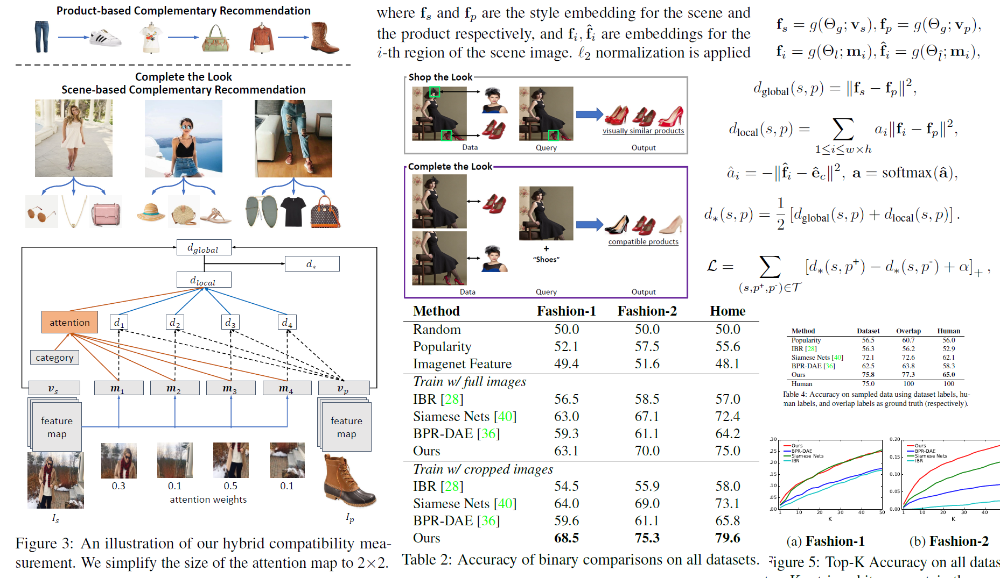
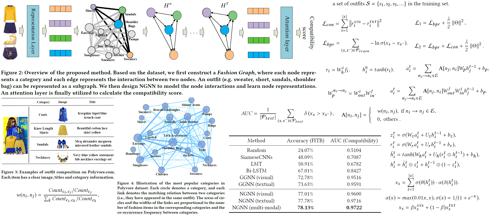
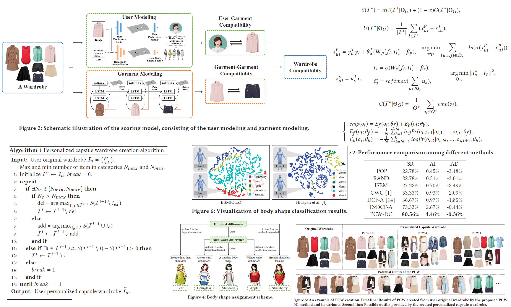
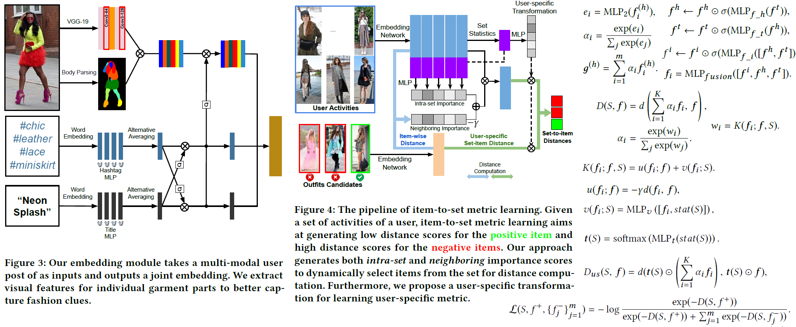
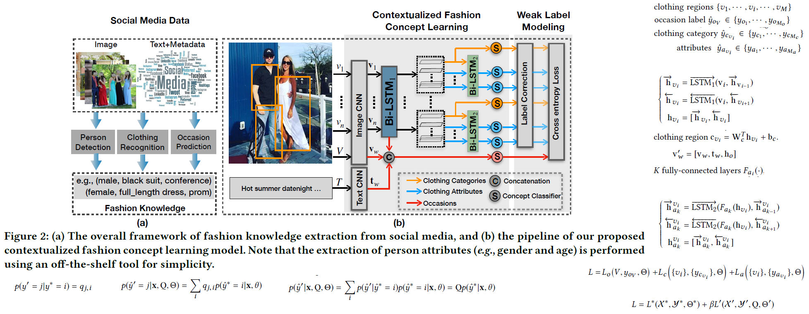

# Fashion推荐

## [2018-Interpretable multimodal retrieval for fashion products](https://dl.acm.org/doi/abs/10.1145/3240508.3240646)

引用数：23	来源：Proceedings of the 26th ACM international conference on Multimedia.

## [2019-Complete the look: Scene-based complementary product recommendation](http://openaccess.thecvf.com/content_CVPR_2019/html/Kang_Complete_the_Look_Scene-Based_Complementary_Product_Recommendation_CVPR_2019_paper.html)

引用数：20	来源：Proceedings of the IEEE Conference on Computer Vision and Pattern Recognition.

bridge the gap between scene images and product images，任务：Learning scene-product compatibility，constructing appropriate groundtruth data。we seek to learn a unified style space where compatible scenes and products are close, as they ought to represent similar styles.

+ 以前的研究：product-to-product compatibility、retrieve similar looking (or even identical) products given a scene image。Clothing ‘parsing’、pairwise compatibility、outfit compatibility。
+ 数据集：Shop the Look：retrieving visually similar (or even identical) products based on a scene image and a bounding box containing the query product。containing compatible pairs consisting of a scene image and a product image。
  + 数据集：human-labeled datasets which include bounding boxes of products in scene images，the associated product images, as well as the category of each product。如Exact Street2Shop、Pinterest’s Shop The Look，
  + 本文数据集：to remove the product by cropping the scene image。model ‘sees’ the product in the scene image；learn to detect whether the product appears in the scene，instead of measuring compatibility。
  + Generating CTL Datasets：consider four candidate regions (i.e., top, bottom, left, and right) that don’t overlap with bounding box B；select  the greatest area as the cropped scene image；discard scene-product pairs for which the area of the cropped image is smaller than a threshold。
+ 方法：1）adopt ResNet-50 to extract visual features。a visual feature vector from the final layers (e.g. pool5), and a feature map(w×h) from intermediate convolutional layers (e.g. conv4 6)。2）measure compatibility by considering both global and local compatibility in a unified style space
  + Global compatibility：learn style embeddings from compatible scene and product images, where nearby embeddings indicate high compatibility，a two-layer feed forward network transform the visual features to a d-dimensional
  + Local compatibility：match every region of the scene image with the product image；adopt **category-aware attention** to assign weights over all regions。
+ 目标函数：hinge loss，（scene , positive product, negative product）negative product from the same category

## [2019-Dressing as a whole: Outfit compatibility learning based on node-wise graph neural networks](https://dl.acm.org/doi/abs/10.1145/3308558.3313444)

引用数：20	来源：The World Wide Web Conference

represent an outfit as a graph. In particular,  each node represents a category and each edge represents interaction between two categories. Accordingly, each outfit can be represented as a subgraph by putting items into their corresponding category nodes. 

+ 之前工作：pair representation and sequence representation；
+ 数据集：Polyvore dataset，21889 outfits covering 380 categories；17316 for training, 1497 for validation and 3076 for testing；修改：categories appear more than 100 times，120 categories remain；outfits consisting of more than 3 items;remain 16983 outfits in the training set, 1497 in the validation set and 2697 in the test set.
+ Features：images of items and titles，InceptionV3，filter out the words which appear in less than 5 items and less than 3 characters，2757 words。
+ 问题定义：Given an outfit s consisting of |s| items (each item has an image and textual description), we aim to predict the compatibility score of the outfit。
+ Graph Construction：if two categories have matching relation in the training dataset, there are two directed edges in reverse directions between the two corresponding nodes.
  + Learning Initial Node State：input of NGNN is features (either visual or textual features) of items，map its feature to a latent style space with the size of d.
  + Modeling Node Interactions：nodes will receive sum of neighbors’ state。update the state similar to GRU .
  + Compatibility Calculating with Attention Mechanism：1）items have different influence on an outfit.2）same item plays different roles in  different outfits。utilize self-attention  to calculate the graph-level output and also the outfit compatibility score。
+ NGNN with Multi-modal Input：input the visual features and textual features to the two channels of NGNN respectively and obtain a visual compatibility score and a textual compatibility score；use a regularization to ensure the consistency between the visual and textual feature of the same item in the shared latent space。
+ Training Strategy：outfits in the training dataset as positive outfits，randomly select an item replace it with a random item to form a negative
  outfit。
+ Task Description：
  + Fill-in-the-blank Fashion Recommendation：Given a set of fashion items and a blank, we aim to find the most compatible item from the candidates set to fill in the blank。
  + Compatibility Prediction：to predict the compatibility score for any given outfit

## [2019-Personalized Capsule Wardrobe Creation with Garment and User Modeling](https://dl.acm.org/doi/abs/10.1145/3343031.3350905)

引用数：3	来源：Proceedings of the 27th ACM International Conference on Multimedia.

automatic creation of capsule wardrobes by the garment modeling。Capsule wardrobe (CW) is a minimum collection of garments。

+ 以前方法的缺点：fail to consider the user profile；改进：user modeling（user preference and body shape） and garment modeling.
+ 定义：given the original wardrobe (i.e., a set of purchased garments) of a user, adding or deleting garments according to both user-garment and garment-garment compatibilities。
+ 方法：propose a comprehensive wardrobe compatibility scoring model。
  + User Modeling：latent space：1）User Preference Modeling，2）User Body Shape Modeling（user’s historical reviews）
  + Garment Modeling：all potential outfits
  + PCW Creation：delete items from the original wardrobe that can degrade the overall wardrobe compatibility and add candidate items that can improve the compatibility.
+ 数据集：user modeling：collecting the user purchase histories from Amazon；garment modeling：public Polyvore dataset；
+ Body Shape Assignment Scheme：bust girth, waist girth and hip girth；hip-bust and bust-waist differences as the reference。
+ 评价指标：successful rate (SR), average improvement (AI) and average diminishment (AD)，A修改成功的。

## [2020-Personalized Fashion Recommendation from Personal Social Media Data: An Item-to-Set Metric Learning Approach](https://arxiv.org/abs/2005.12439)

引用数：0	来源：arXiv preprint arXiv（under review in ACMMM ’20）

recommending new outfits to social media users that fit their fashion preferences

+ **social networks** provide an open and new data source for personalized fashion analysis。a user can have interest in more than one fashion style。
+ 方法：item-to-set metric learning framework that learns to compute the similarity between **a set of historical fashion items(selfie posts)** of a user to **a new fashion item(outfit items)**。propose an importance weight for each item in the set
+ 实现：
  + Data Prepossessing：detection model to crop person bounding-boxes；Wikipedia pretrained GloVe text embedding to extract title and hashtag features.
  + **Fashion Item Embedding Module**：image-hashtag-title triplets；
    + Image Feature Extraction：body parsing model+image recognition model
    + Hashtag/Title Feature Extraction： MLP+attentive averaging
    + Cross-modality Gated Fusion：MLP
  + **Item-to-set Metric Learning**：~~averaged item-to-set distance、nearest-neighbor item-to-set distance~~，assign an importance weight。
    + Importance Estimation：neighboring importance weight、intra-set importance weight；
    + User-specific Metric Space：perform a user-specific space transformation before the distance computation
  + Learning Objectives：generate a positive item from the same user and m negative items from the other users.
+ 实验：Lookbook.nu上2293个用户的近100个自拍post。取每个用户最近的post作为候选推荐。将1834个用户划到训练集。

## [2020-Emerging Topic Detection on the Meta-data of Images from Fashion Social Media](https://dl.acm.org/doi/abs/10.1145/3394171.3413914)

引用数：	来源：Proceedings of the 28th ACM International Conference on Multimedia

find the emergence of people’s new tastes in the early stage based on the photos posted 

+ 以前：focus only on individual items for trend detection. Therefore,

# Fashion Knowledge

## [2019-Who, Where, and What to Wear? Extracting Fashion Knowledge from Social Media](https://dl.acm.org/doi/abs/10.1145/3343031.3350889)

引用数：8	来源：Proceedings of the 27th ACM International Conference on Multimedia

automatically harvest fashion knowledge from social media；unify three tasks of occasion, person and clothing discovery from multiple modalities of images, texts and metadata。

+ 问题：few studies at knowledge level in fashion domain； where and how can we collect such fashion knowledge? dependant on the performance of  fashion concept prediction；lacks sufficient fashion concept labels。

+ 定义：user centric fashion knowledge as triplets of the form $K = \{Person, Clothing, Occasion\}$；a set of user-generated posts $X=\{V_{image},T_{text},M_{metadata(time, location)}\}$。
+ 任务：person attributes detection，2) clothing categories and attributes detection，and 3) occasion prediction。
+ 数据集：crawl millions of posts from Instagram；Both automated and manual filtering bad data；Occasion annotation；Annotation of clothing categories and attributes（30% image refined by human annotators）；
+ 方法：
  + contextualized fashion concept learning module：clothing detection module；Category Representation，Occasion Representation，Attribute Representation，predict the there labels。bidirectional LSTM。
  + using weakly labeled data：depends only on the true label；incorporate a label transition matrix。
  + Obtaining and Analyzing Fashion Knowledge：a piece of fashion knowledge is useful when it is widely adopted. 
+ Baseline Methods：DARN2015，FashionNet2016，EITree2018；

# Try-on

## [2018-Viton: An image-based virtual try-on network](http://openaccess.thecvf.com/content_cvpr_2018/html/Han_VITON_An_Image-Based_CVPR_2018_paper.html)

引用数：145	来源：Proceedings of the IEEE conference on computer vision and pattern recognition

+ 任务：transfers a desired clothing item onto the corresponding region of a person using a coarse-to-fine strategy.
+ deform the target clothing image to fit the pose of a person.
  + Pose heatmap、Human body representation、Face and hair segment
  + Multitask EncoderDecoder Generator
  + Refinement Network

## [2018-Toward characteristic-preserving image-based virtual try-on network](http://openaccess.thecvf.com/content_ECCV_2018/html/Bochao_Wang_Toward_Characteristic-Preserving_Image-based_ECCV_2018_paper.html)

引用数：81	来源：Proceedings of the European Conference on Computer Vision (ECCV)

given a person image and target clothes，replace the clothes of the person with the target clothes。

+ synthesize a new image of the wearer in the new cloth。sample triplets $(I_i, c, I_t)$ is difficult to collect，make $I_i=I_t$。constructing a clothing-
  agnostic person representation when test。
+ 方法：Person Representation
  + Geometric Matching Module：warping an image
  + Try-on Module：synthesizing the final try-on result.

## [2020-Down to the Last Detail: Virtual Try-on with Fine-grained Details](https://dl.acm.org/doi/abs/10.1145/3394171.3413514)

引用数：0	来源：Proceedings of the 28th ACM International Conference on Multimedia.

+ 任务：**person image generation** given arbitrary **poses and clothes**. $(I_{p_s},p_t,C)\to I_{p_t}$
+ 以前问题：hardly preserve the finegrained details。clothing textures 、salient regions
+ 之前方法：1）build 3D human model——costs，2）feature warping and bi-directional framework——weakness。
+ 相关工作：General Image Synthesis、Person Image Generation、Virtual Try-on、Video Generation
+ 本文工作：decompose the generation into spatial alignment followed by a coarse-to-fine generation
  + Tree Dilated Fusion Block：aggregates multiscale features and captures more spatial information with **dilated convolutions**.
  + Fine-grained Detail Synthesis：1）parsing transformation network；2）clothing spatial alignment；Detailed Appearance Generation
  + Face Refinement：

+ 数据集：MPV dataset：14,754 pairs of top clothing images and  positive perspective images of female models。