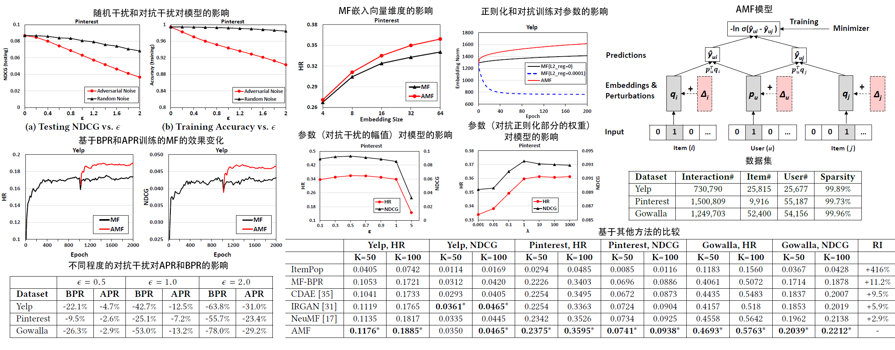
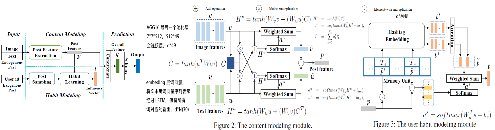
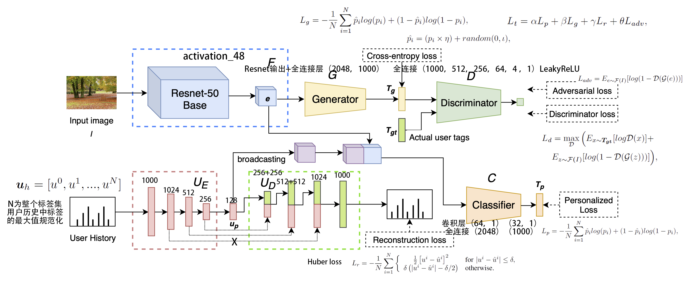

# 推荐

## [2001-Item-based collaborative filtering recommendation algorithms](https://dl.acm.org/doi/pdf/10.1145/371920.372071)

引用数：9183	来源：Proceedings of the 10th international conference on World Wide Web

+ **问题**：访问人数越来越多。传统基于user-CF方法的工作量随着用户的增多而增大，通过查找相似用户来进行推荐必然会碰到瓶颈。
+ CF模型将整个用户-物品$m\times n$评分作为输入矩阵，可分为基于memory-based(user)和model-based(item)的两种。前者基于矩阵找相似的用户，后者对用户的评分建模。
+ 本文研究item间的关系，因为item间的关系相对static，可以推荐**与用户喜好物品相似的物品**来提升速度。
+ **方法**：主要分为两步，1.计算物品相似度，2.评分计算。
  1. 挑出那些在i,j两item上都进行了评分的人，然后计算i，j相似性：
     + `cosine-based similarity`：将i，j视为由用户评分组成的向量，相似性为向量角度的cos值；$sim(i,j)=\cos(\vec i,\vec j)=\frac{\vec i\cdot \vec j}{||\vec i||_2*||\vec j||_2}$
     + `correlation-based similarity`：`Pearson-r correlation`，设对i，j都评价的人的集合为U，则$sim(i,j)=\frac{\sum_{u\in U}(R_{u,i}-\bar R_i)(R_{u,j}-\bar R_j)}{\sqrt{\sum_{u\in U}(R_{u,i}-\bar R_i)^2}\sqrt{\sum_{u\in U}(R_{u,j}-\bar R_j)^2}}$，$\bar R_i$为物品i的平均评分。
     + `adjusted-cosine similarity`：考虑不同用户打分的范围，$sim(i,j)=\frac{\sum_{u\in U}(R_{u,i}-\bar R_u)(R_{u,j}-\bar R_u)}{\sqrt{\sum_{u\in U}(R_{u,i}-\bar R_u)^2}\sqrt{\sum_{u\in U}(R_{u,j}-\bar R_u)^2}}$。
  2. 计算物品的评分：
     + `Weighted Sum`：通过用户在与i相似的物品上的评分来推测对i的评分，$P_{u,i}=\frac{\sum_{all\ similar\ items,N}(s_{i,N}*R_{u,N})}{\sum_{all\ similar\ items,N}(|s_{i,N}|)}$
     + `Regression`：相似物品的评分$R_N$,i物品的评分$R_i$；则$\bar R'_N=\alpha \bar R_i+\beta+\epsilon$ 。
+ 数据集：Movie data from `movielens`；选择评分电影超20部的用户，交互大概有1百万个，然后将该数据集分为训练集和测试集。
+ 评价指标：本文使用MAE，$MAE=\frac{\sum_{i=1}^N|p_i-q_i|}{N}$。
+ 测试不同参数(领域大小、train/test比例，不同相似性测量方法)对算法的影响，选择最优解，然后固定参数。该过程只在训练集上进行10折交叉验证。
+ 实验结果：
  + 相似性算法：使用加权和产生预测，`adjusted cosine similarity`最好。
  + `Training/Test`比例x：使用两种预测生成方法，x增加，MAE越小，，取两条预测生成方法曲线的交点，x=0.8.
  + 领域大小：加权和随领域增大，MAE越小，并趋于平缓；回归方法随着领域增大，MAE越大。选择领域大小为30.
+ 论文里的图

## [2009-Matrix factorization techniques for recommender systems](https://ieeexplore.ieee.org/abstract/document/5197422/)

引用数：7437	来源：Computer

+ 在Netflix竞赛上证明矩阵分解技术好于最近邻方法。并且可以结合其他信息（隐反馈、时间等）。

+ 主要的方法：

  + `the content filtering approach\content-based`，创造刻画用户或物品的资料，然后使用资料关联用户和匹配的物品。
  + `past user behavior\collaborative filtering`，分析用户间的关系，物品间的相关性，然后据此确定用户物品关系。又可以分为领域的方法和建立隐因素模型的方法。

+ 推荐系统的输入，有明显反馈输入的系统，一般是一个矩阵，坐标轴一般为用户、用户在物品上的评分，是一个稀疏矩阵。

+ **方法**：

  > + 基本的`matrix factorization`模型
  >
  >   + ==将用户和物品映射到一个$f$维度的联合因素空间，用户-物品的交互可用空间中的内积表示==。物品可表示为$q_i\in R^f$，用户表示为$p_u\in R^f$；空间中的每一维表示用户(物品)在该维上的喜好(程度)。$q_i^Tp_u$表示用户u与物品i的交互(兴趣)，近似用户的评分$\hat{r}_{ui}$。当学的映射后，可用==$\hat{r}_{ui}=q_i^Tp_u$==来预测用户u在物品i上的评分。
  >
  >   + 这种方法与奇异值分解`singular matrix decomposition`紧密相关。由于稀疏性，无法直接将SVD应用到CF。一种是填充数据，另一种是只用已有数据，通过正则化防止过拟合。即：
  >     $$
  >     \min_{q^*,p^*}\sum_{(u,i)\in K}(\hat{r}_{ui}-q_i^Tp_u)^2+\lambda(||q_i||^2+||p_u||^2) \tag{1}
  >     $$
  >
  > + 学习方法：
  >
  >   + `stochastic gradient descent`：随机梯度下降
  >   + `alternating least squares`：交替固定一个参数，依次解一个最小二乘问题，可并行处理。
  >
  > + 添加`baises`
  >
  >   + 由于用户等原因，会产生一些变化，如一些用户偏向于给一些物品高分。
  >
  >   + 一阶偏差可定义为：$b_{ui}=\mu+b_u+b_i$。分别代表：整体平均值，用户bias，物品bias；则评分可表示为：
  >     $$
  >     \hat{r}_{ui}=\mu+b_u+b_i+q_i^Tp_u \tag{2}
  >     $$
  >
  > + 添加额外输入，解决`cold start problem`，提供的评分较少的情况。
  >
  >   + 设$N(u)$表示用户有隐偏好的物品集合(如历史购物、浏览情况)。用户在该集合上的偏好可表示为$\sum_{i\in N(u)}x_i$，$x_i\in R^f$。
  >
  >   + 设$A(u)$表示用户对应的属性集合(如性别、年龄)，用户在相关属性集合上可表示为$\sum_{a\in A(u)}y_a$，$y_a\in R^f$。
  >
  >   + 所以评分表示为：可再添加额外的物品属性。
  >     $$
  >     \hat{r}_{ui}=\mu+b_u+b_i+q_i^T[p_u+|N(u)|^{-0.5}\sum_{i\in N(u)}x_i+\sum_{a\in A(u)}y_a] \tag{3}
  >     $$
  >
  > + `temporal dynamics`：偏好会随时间变化
  >
  >   + 用户偏差，物品偏差，用户偏好都可能随时间变化，所以，评分可表示为：
  >     $$
  >     \hat{r}_{ui}(t)=\mu+b_u(t)+b_i(t)+q_i^Tp_u(t) \tag{4}
  >     $$
  >
  > + 加上`confidence level`：打分的可信度是不一样的，如一个视频看的次数。
  >
  >   + 添加可信度，问题变为：
  >     $$
  >     \min_{q^*,p^*}\sum_{(u,i)\in K}c_{ui}(\hat{r}_{ui}-\mu -b_u-b_i-q_i^Tp_u)^2+\lambda(||q_i||^2+||p_u||^2+b_u^2+b_i^2) \tag{5}
  >     $$
  >     $c_{ui}$表示用户u在物品i上的置信度。

+ 数据集：Netflix数据集（大约），训练集100百万个评分，0.5百万用户，1.7万的电影；测试集，预测3百万个评分。

+ 评价指标：计算`root-mean-square error (RMSE)`，$RMSE=\sqrt\frac{\sum_{i=1}^N(p_i-q_i)^2}{N}$。

+ 实验结果：由（1）-（5）参数越多，性能越好。

## [2010-Factorization machines](https://ieeexplore.ieee.org/abstract/document/5694074/)

引用数：1217	来源：2010 IEEE International Conference on Data Mining

+ **问题**：很多分解方法(如MF、parallel factor analysis、SVD++、PITF、FPMC)，缺点是无法广泛应用到普遍的预测问题。只能针对特定的输入(任务)。

+ FM结合了SVM和分解模型的优点，是具有一般性的预测器，计算复杂度是线性的，能对变量间的各种交互建模（包括高稀疏的数据）。

+ 方法：

  > + 将输入编码为向量，输入$x\in R^n$，输出$y\in R$，
  >
  > + d=2的模型方程：
  >
  >   + 传统的SVM的方法，如$\hat y(x):=w_0+\sum_n w_ix_i+\sum_{i=1}^n \sum_{j=i+1}^nw_{i,j}x_ix_j$；变量w间的交互视为独立的，使用`maximum margin `,会导致在测试中的训练集中未出现的交互$w_{i,j}=0$；
  >
  >   + 本文的方法：
  >     $$
  >     \hat y(x):=w_0+\sum_n w_ix_i+\sum_{i=1}^n \sum_{j=i+1}^n<\mathtt v_i,\mathtt v_j>x_ix_j \tag{eq1}
  >     $$
  >     $w_{i,j}:=<\mathtt v_i,\mathtt v_j>$表示第i,j两个变量的交互，$\mathtt v_i\in R^k$。
  >
  > + eq1的计算量为$O(kn^2)$；由于经过变换，$\sum_{i=1}^n \sum_{j=i+1}^n<\mathtt v_i,\mathtt v_j>x_ix_j=\frac{1}{2}\sum_{f=1}^k((\sum_{i=1}^nv_{i,f}x_i)^2-\sum_{i=1}^2v_{i,f}^2x_i^2)$；则计算量为$O(kn)$。只算非零元素，则计算量为$O(k\bar m_D)$；$\bar m_D$为输入向量中的非零元素的平均个数。
  >
  > + FM对可实现其他方法：
  >
  >   + `MF`：只取user和item；$\hat y(\mathtt x)=w_0+w_i+w_u+<\mathtt v_u,\mathtt v_i>$。
  >   + `SVD++`：考虑输入的前三项，$\hat y(\mathtt x)=w_0+w_i+w_u+<\mathtt v_u,\mathtt v_i>+\frac{1}{\sqrt{|N_u|}}\sum_{l\in N_u}<\mathtt v_i,\mathtt v_l>$。
  >   + `PITF`：推荐标签，$\hat y(\mathtt x)=w_0+w_u+w_i+w_t+<\mathtt v_u,\mathtt v_i>+<\mathtt v_u,\mathtt v_t>+<\mathtt v_i,\mathtt v_t>$；使用`pairwise ranking`则变为：$\hat y(\mathtt x)=w_t+<\mathtt v_u,\mathtt v_t>+<\mathtt v_i,\mathtt v_t>$。
  >
  > + `Factorized Personalized Markov Chains (FPMC)`：基于用户上次购买情况对商品排序；$\hat y(x)=w_i+<\mathtt v_u,\mathtt v_i>+\frac{1}{|B_{t-1}^u|}\sum_{l\in B_{t-1}^u}<\mathtt v_i,\mathtt v_l>$。$B_{t-1}^u$为用户t-1时买的物品。

+ 数据集：ECML、Netflix。

## [2012-BPR: Bayesian personalized ranking from implicit feedback](https://arxiv.org/abs/1205.2618)

引用数：2728	来源：Proceedings of the Twenty-Fifth Conference on Uncertainty in Artificial Intelligence（2009）

+ **问题**：有很多以隐反馈`implicit feedback`(如购买浏览历史)输入，实现个性化推荐(MF,kNN)，但它们都**没有直接针对排名进行优化**。为优化排名，提出了一般化的优化标准`BPR-OPT`，和一般化的学习算法`LearnBPR`。

+ 方法：

  > + 在隐反馈系统中，只有正例$S$（用户喜欢的）被观测到，其他数据是真负例和缺失值的样例组成；
  >
  >   + 以前的方法是将观测的数据视为正例(1)，其他视为负例(0)，以此作为数据集；然后对该数据建模。所以模型学到的是：$p(i)=\begin{cases} 1 & i \in S\\ 0 & i\notin S \end{cases}$。未来需要预测的item在训练中被视为负例。之前模型能进行预测的原因是有正则项，防止了过拟合。
  >   + 本文使用物品对==item pairs==作为训练数据，假设用户对浏览过的物品的喜好程度超过未浏览的物品。则训练集$D_S:=\{(u,i,j)|i\in I_u^+ \land j\in I\setminus I_u^+\}$；$(u,i,j)$表示用户u相比j更喜欢i。
  >
  > + `BPR Optimization Criterion`：[参考](https://zhuanlan.zhihu.com/p/60704781)
  >
  >   + 为所有物品进行正确的个性化排序的Bayesian公式是==最大化模型参数的后验概率==：$p(\Theta |>_u)$，正比于$\propto p(>_u|\Theta)p(\Theta)$。$\Theta$为模型参数，$>_u$为用户想要的item排序。因此相当于最大化似然函数$p(>_u|\Theta)$。
  >
  >   + 两点假设：
  >
  >     + 用户之间相互独立。
  >     + 一个用户对物品对(i，j)的顺序与其他物品对的顺序相互独立。
  >
  >   + 对于所有用户,似然函数：$\prod_{u\in U}p(>_u|\Theta)=\prod_{(u,i,j)\in U\times I\times I}p(i>_uj|\Theta)^{(u,i,j)\in D_S}\cdot (1-p(i>_uj|\Theta))^{(u,j,i)\notin D_S}$；可简化为：$\prod_{u\in U}p(>_u|\Theta)=\prod_{(u,i,j)\in D_S}p(i>_uj|\Theta)$。
  >
  >   + 定义用户相比j更喜好i的单个概率为：$p(i>_uj|\Theta):=\sigma(\hat x_{uij}(\Theta))$。$\sigma$为sigmoid函数。$\hat x_{uij}$是模型参数$\Theta$学到的$(u,i,j)$间的关系。
  >
  >   + 对于先验概率$p(\Theta)$，可以使用正态分布$p(\Theta)\sim N(0,\Sigma_{\Theta})$。$\Sigma_{\Theta}$为协方差矩阵。为了减少参数，设$\Sigma_{\Theta}=\lambda_{\Theta}I$。$\lambda_{\Theta}$为模型正则项。
  >
  >   + ==则一般性的优化标准为==：
  >     $$
  >     \begin{align*} BPR-OPT &:=\ln p(\Theta |>_u) \\&=\ln p(>_u|\Theta)p(\Theta) \\&=\sum_{(u,i,j)\in D_S}\ln \sigma(\hat x_{uij})-\lambda_{\Theta}||\Theta||^2 \end{align*} \tag{eq1}
  >     $$
  >
  > + `BPR Learning Algorithm`：
  >
  >   + 梯度：$\frac{\partial BPR-OPT}{\partial \Theta} \propto \sum_{(u,i,j)\in D_S}\frac{-e^{-\hat x_{uij}}}{1+e^{-\hat x_{uij}}}\cdot\frac{\partial}{\partial\Theta}\hat x_{uij}-\lambda_{\Theta}\Theta$；
  >   + 整体梯度下降是在所有训练集上求梯度，再更新参数，收敛缓慢。
  >   + 随机梯度下降在==一个训练样本上==进行参数更新，但容易受训练样本的顺序影响。
  >   + 采用随机抽取（均匀分布）的方法`bootstrap sampling`，防止在连续更新中一直抽到相同的用户物品整合。
  >
  > + `Learning models with BPR`：
  >
  >   + 以前方法是对(u,i)对给出一个值，因此我们将评估值$\hat x_{uij}$分解定义为$\hat x_{uij}:=\hat x_{ui}-\hat x_{uj}$。
  >   + `Matrix Factorization`：将矩阵$X\in R^{U\times I}$分解为$W\in R^{U\times f}$和$H\in R^{I\times f}$；预测值表示为$\hat x_{ui}=<w_u,h_i>=\sum_{f=1}^k w_{uf}\cdot h_{if}$。

+ 数据集：`Rossmann dataset`：来自在线商店的购买记录；`Netflix`：电影DVD租赁记录，包含评分（实验中将评分都视为1）。

+ 评价指标：$AUC=\frac{1}{|U|}\sum_u\frac{1}{E(u)}\sum_{(i,j)\in E(u)}\delta(\hat x_{ui}>\hat x_{uj})$，$E(u)$为用户u的样本对(i,j)，测试集里的物品i，未交互过的物品j。

+ 实验方法：通过留一法，随机从每一个用户中抽出该用户交互过的一个物品，构成测试集，其他为训练集；进行测试；重复10轮，第一轮确定参数后，后面不再改变参数。

## [2018-Adversarial personalized ranking for recommendation](https://dl.acm.org/doi/abs/10.1145/3209978.3209981)

引用数：115	来源：The 41st International ACM SIGIR Conference on Research & Development in Information Retrieval	[代码](https://github.com/hexiangnan/adversarial_personalized_ranking)

+ **问题**：用BPR优化的MF推荐模型对**模型参数的对抗干扰**并不够鲁棒，

+ 为了提升鲁棒性和泛化能力，本文提出了新的优化框架APR（使用对抗训练提升BPR）。在用户物品的嵌入向量上添加干扰实现MF上的APR。

+ **证明MF-BPR对对抗噪声是脆弱的**：对抗图像生成的方法不能直接应用到输入$(u,i,j)$，因为会改变输入语义信息，导致输出巨大变化；本文选择作用于模型的参数（MF的嵌入向量），假设**模型参数的微小变化不会导致输出的剧烈变化**，如果某种干扰比随机干扰更有效，则表明模型对这种干扰敏感。

  + 定义对抗干扰为使BPR目标函数最大的干扰：$\Delta_{adv}=\arg{\max \atop \Delta,||\Delta||<\epsilon}L_{BPR}(D|\hat\Theta+\Delta)$。$\hat\Theta$为确定值。

+ **APR模型**：设计一个新的目标函数，使其能胜任个性化排序和抵抗对抗干扰，最小化目标函数：
  $$
  L_{APR}(D|\Theta)=L_{BPR}(D||\Theta)+\lambda L_{BPR}(D|\Theta+\Delta_{adv}) \tag{1}
  $$

  通用的训练方法SGD：

  1. **构造对抗干扰**：随机抽取训练样本$(u,i,j)$，最大化：$l_{adv}((u,i,j)|\Delta)=-\lambda\ln\sigma(\hat y_{uij}(\hat\Theta+\Delta))$。使用户u对物品ij难以区分。通过线性函数近似目标函数，使用fast gradient，即朝着梯度方向移动，
     $$
     T:=\frac{\partial l_{adv}((u,i,j)|\Delta)}{\partial \Delta}=-\lambda(1-\sigma(\hat y_{uij}(\hat\Theta+\Delta)))\frac{\partial\hat y_{uij}(\hat\Theta+\Delta)}{\partial \Delta} \tag{2}
     $$
     则在max-norm限制下，$\Delta_{adv}=\epsilon\frac{T}{||T||}$。

  2. **模型参数学习**：由(1)有：
     $$
     l_{APR}((u,i,j)|\Theta)=-\ln\sigma(\hat y_{uij}(\Theta))+\lambda_{\Theta}||\Theta||^2-\lambda\ln\sigma(\hat y_{uij}(\Theta+\Delta_{adv})) \tag{3}
     $$
     用SGD方法更新参数：$\Theta=\Theta-\eta\frac{\partial l_{APR}}{\partial\Theta}$。

  3. 依次执行1，2；**注意**：模型参数$\Theta$由BPR进行初始化。因为只有当模型过拟合后加干扰才有意义。

+ **MF上的APR方法**：MF的参数是用户物品的嵌入向量，定义干扰为：$\hat y_{ui}(\Theta+\Delta)=(p_u+\Delta_u)^T(q_i+\Delta_i)$。进行小批量训练，

+ **数据集**：Yelp、Pinterest、Gowalla；

+ **对比方法**：ItemPop（基于物品受喜好程度），MF-BPR，CDAE（基于Denoising Auto-Encoder），NeuMF（结合MF和MLP）,IRGAN（生成器和判别器进行对抗训练）

+ **评价指标**：HR（点击率，基于召回率）、NDCG（位置敏感）

+ **实验结果**：

## [2018-Self-attentive sequential recommendation](https://ieeexplore.ieee.org/abstract/document/8594844/)

引用数：138	来源：2018 IEEE International Conference on Data Mining (ICDM)

+ Sequential dynamics的目的是基于用户历史行为，获得用户行为的上下文信息；主要有Markov Chains (MCs)和RNN；前者利用最近的行为，适合比较稀疏的数据；后者可利用长远的语义，适合比较密集的数据。

+ 本文目标是平衡两者，提出基于自注意力的模型，可获得长的语义，并用注意力机制，基于较少的行为得到预测。

+ Temporal Recommendation对用户行为的时间戳建模；Sequential recommendation对用户行为的顺序建模。

+ 序列推荐模型：FPMC、Caser、GRU4Rec

+ 方法：输入用户行为序列$S^u=(S_1^u\dots S_{|S^u|-1}^u)$，输出一个平移的序列$(S_2^u\dots S_{|S^u|}^u)$。

  + 嵌入层：将训练序列$S^u$变为固定长度的序列$s=(s_1,\dots,s_n)$，大于n考虑最近的n个，小于n前面填0。所有物品的嵌入矩阵$M\in R^{|I|\times d}$，输入序列变为$E\in R^{n\times d}$。添加Positional Embedding：$P\in R^{n\times d}$。输入为$\hat E=E+P$。

  + **Self-Attention**：
    $$
    S=SA(\hat E)=Attention(\hat EW^Q,\hat EW^K,\hat EW^V)=softmax(\frac{\hat EW^Q(\hat EW^K)^T}{\sqrt d}\hat EW^V) \tag{1}
    $$
    因为预测t+1时只能考虑前t个的item，而Self-Attention会考虑之后的item，所以需要禁止之后的连接。

  + **Point-Wise Feed-Forward Network**：考虑不同隐藏层维度间的关系和赋予模型非线性，为每个$S_i$添加两层feed-forward网络（参数共享）：
    $$
    F_i=FFN(S_i)=ReLU(S_iW^{(1)}+b^{(1)})W^{(2)}+b^{(2)} \tag{2}
    $$

  + **Stacking Self-Attention Blocks**：由self-attention layer and a feedforward network构成一个基本块，堆叠块以便获得更复杂的item transition。层数越多，会出现过拟合、训练不稳定、更多训练时间等问题，对以上两个网络层进行如下操作：Residual Connections，Layer Normalization，Dropout；g代表网络。在embeding层也使用dropout。
    $$
    g(x)=x+Dropout(g(LayerNorm(x)))  \tag{3}
    $$
    其中$LayerNorm(x)=\alpha\odot\frac{x-\mu}{\sqrt{\sigma^2+\epsilon}}+\beta$，$\mu,\sigma$是x的均值和方差，$\alpha,\beta$是学到的参数。

  + **Prediction Layer**：使用最后一层的$F_t^{(b)}$来预测下一个item。使用MF layer来预测物品的相关性，$N\in R^{|I|\times d}$(实际选100个负例和一个正确的item)
    $$
    r_{i,t}=F_t^{(b)}N_i^T \tag{4}
    $$
    对所有物品进行相关性计算，然后排序得到预测列表。为了减少参数和提升性能，使用Shared Item Embedding，即N=M。使用Explicit User Modeling并没有提升效果。

  + Network Training：输入是固定长度的序列s，输出也是固定长度的序列，$o_t=\begin{cases}<pad> & {s_t}\text{为pad}\\s_{t+1}& 1<t<n\\S_{|S^u|}^u & t=n\end{cases}$。使用binary cross entropy loss作为目标函数：
    $$
    -\sum_{S^u\in S}\sum_{t\in[1,\dots,n]}[\log(\sigma(r_{o_t,t}))+\sum_{j\notin S^u}\log(1-\sigma(r_{j,t}))] \tag{5}
    $$
    使用adam进行优化，每一epoch，为每一个序列在每一步随机选取一个负例j。

+ 数据集：Amazon、Steam、MovieLens-1M，将评论或评分视为隐反馈。去掉少于5的用户和物品，最后一个测试集，倒数第二个为验证集，剩下的为训练集。

+ 评价指标：Hit Rate@10 and NDCG@10,

## [2019-On the difficulty of evaluating baselines: A study on recommender systems](https://arxiv.org/abs/1905.01395)

引用数：13	来源：arXiv preprint arXiv

+ **问题：正确地运行baselines是困难的**，过去在Movielens 10M上对比的baseline是次优的，对其进行调整，可以获得更好的效果。所以研究只能和最优的baseline进行比较才有效。
+ 在Movielens 10M上，通过小心地调整，baseline获得了提升，甚至超过了之前的方法。
+ Movielens 10M进行9:1的划分。使用RMSE进行评价。
  + 对于Biased MF, RSVD, ALS-WR, BPMF等baseline：
    + Biased MF, RSVD本质上是同一种方法，差别是配置（超参数、训练集顺序、实现）
    + ALS-WR与上Biased MF, RSVD是不同算法学到的相同模型。
    + BPMF和RSVD，ALS-WR共享模型，但通过一个Gibbs sampler进行学习。
  + 重新运行baseline：
    + 使用SGD学到的MF（类似Biased MF, RSVD），使用Gibbs采样训练Bayesian-MF（类似BPMF），获得了更好的效果。
    + 使用隐反馈和时间影响。如给Bayesian-MF加时间等获得更好的baseline。
+ 在Netflix Prize同样证明了正确运行baseline是困难的。数据集包括训练集、验证集、测试集，通过用户和时间进行划分，如最近的6个作为（前3个）验证集和（后3个）测试集。
  + 标准的MF通过不同的算法获得不同的效果
  + 更好的方法是组合多个模型。
  + 在Netflix Prize上表现好的模型在Movielens 10M也表现好，反之则不一样。
+ 目前可靠实验指标的不足：statistical signicance, reproducibility or hyperparameter search；因为他们没有说明方法最好时的配置。
+ 提高实验质量：需要社区的努力，标准的baseline和提升baseline的激励。

+ 附录：
  + 数据集：Movielens 10M使用10折交叉验证（90:10），**使用libFM库**
  + 考虑的信息：u用户，i电影，t时间，iu隐含用户信息（用户看过的视频集），ii隐含视频信息（看过该视频的所有用户）。
  + Bayesian Learning考虑的超参数：sampling steps的数目和embedding的维数。初始化高斯分布（标准差0.1）。
  + Stochastic Gradient Descent考虑：学习率0.003和正则化参数0.04，训练集取5%作为验证集确定参数，64维。

## [2019-Kgat: Knowledge graph attention network for recommendation](https://dl.acm.org/doi/abs/10.1145/3292500.3330989) [代码](https://github.com/xiangwang1223/knowledge_graph_attention_network)

引用数：93	来源：Proceedings of the 25th ACM SIGKDD International Conference on Knowledge Discovery & Data Mining

+ 问题：assumes each interaction as an independent instance with **side information** encoded.overlook of the relations among instances or items。do not fully explore the high-order connectivity
+ 方法：take the graph of item side information, aka. knowledge graph。recursive embedding propagation,attention-based aggregation
+ 实现：organize the side information in the form of knowledge graph $G_2$，presented as $\{(h,r,t)|h,t\in E,r\in R\}$。如（Hugh Jackman, ActorOf, Logan）；user-item graph can be seamlessly integrated with KG as a unified graph $G$。任务：given G，output the embedding of user and item，and the probability。
  + Embedding Layer：employ TransR learns embeds each entity and relation by optimizing the translation principl $e_h^r+e_r\approx e_t^r$。
  + Attentive Embedding Propagation Layers：Information Propagation，Knowledge-aware Attention，Information Aggregation。
  + High-order Propagation：concatenate the representations at each step into a single vector
  + Model Prediction：conduct inner product of user and item representations。
+ 实验：BPR Loss，数据集：Amazon-book、Last-FM、Yelp2018。

## [2019-Neural graph collaborative filtering](https://dl.acm.org/doi/abs/10.1145/3331184.3331267)    [代码](https://github.com/xiangwang1223/neural_graph_collaborative_filtering)

引用数：146	来源：Proceedings of the 42nd international ACM SIGIR conference on Research and development in Information Retrieval.

two key components in learnable CF models：embedding；interaction modeling。Learning vector representations (aka. embeddings) of users and items lies at the core of modern recommender systems

+ 问题：the **collaborative signal**, which is latent in user-item interactions，not encoded in the embedding process。
+ 方法：integrate the **user-item interactions** —more specifically the bipartite graph structure—into the embedding process。exploits the user-item
  graph structure by propagating embeddings on it。
+ 实现：
  + Embedding Layer：building a parameter matrix as an embedding look-up table。
  + Embedding Propagation Layers：message-passing architecture of GNNs；perform embedding propagation between the connected users and items。Message Construction，Message Aggregation，High-order Propagation。Propagation Rule in Matrix Form。
  + Model Prediction：concatenating the item representations learned by different layers。inner product。
  + Optimization：optimize the pairwise BPR loss。Message and Node Dropout，
+ 讨论：NGCF generalizes SVD++，
+ 数据集：Gowalla、Yelp2018、Amazon-book；

## [2019-Transparent, scrutable and explainable user models for personalized recommendation](https://dl.acm.org/doi/abs/10.1145/3331184.3331211)

引用数：22	来源：SIGIR 19

+ 

## [2019-MMGCN: Multi-modal graph convolution network for personalized recommendation of micro-video](https://dl.acm.org/doi/abs/10.1145/3343031.3351034)

引用数：21	来源：Proceedings of the 27th ACM International Conference on Multimedia

## [2020-LightGCN: Simplifying and Powering Graph Convolution Network for Recommendation](https://arxiv.org/abs/2002.02126) [代码pytorch](https://github.com/gusye1234/pytorch-light-gcn)、[tensorflow](https://github.com/kuandeng/LightGCN)

引用数：22	来源：(SIGIR ’20)

+ 问题：the reasons of GCN's effectiveness for recommendation；lacks thorough ablation analyses on GCN。
+ 发现：two most common designs in GCNs：feature transformation and nonlinear activation — contribute little to the performance of collaborative filtering. Even worse。原因：GCN is originally proposed for node classification on attributed graph，in recommendation node is only described by a one-hot ID。
+ 思路：simplify the design of GCN，including only the most essential component in GCN — neighborhood aggregation；

## [2020-Disentangled Graph Collaborative Filtering](https://dl.acm.org/doi/abs/10.1145/3397271.3401137)

引用数：2	来源：Proceedings of the 43rd International ACM SIGIR Conference on Research and Development in Information Retrieval

+ 问题：neglecting **the diversity of user intents** on adopting the items。
+ 方法：disentangle these factors and yield disentangled representations。**modeling a distribution over intents for each user-item interaction**。
+ 具体方法：
  1. 将ID embedding分为K个chunks，每chunk表示一个intent；每个chunk的embedding分别执行随机初始化。
  2. 为每个chunk定义一个score matrices，矩阵里的值表示用户和物品的交互。则对于一个交互(u,i)，构成K维的分数向量，都初始化为1；每个chunk的分数矩阵可看作一个图的邻接矩阵。
  3. 所以对于每个intent，包含一个chunk embedding（用户和物品）的集合和图结构（分数矩阵）。在每个intent里，区分每个交互的作用，使用the neighbor routing and embedding propagation mechanisms，定义了graph disentangling layer，收集节点邻域信息（与图的intent信息相关），
  4. 对于每个交互(u,i)的分数向量，通过softmax 标准化，表示在解释这个交互时，哪种intent值得注意。对于每个chunk得到新的分数矩阵（图），

## [2020-JIT2R: A Joint Framework for Item Tagging and Tag-based Recommendation](https://dl.acm.org/doi/abs/10.1145/3397271.3401202)

引用数：1	来源：Proceedings of the 43rd International ACM SIGIR Conference on Research and Development in Information Retrieval

**Predicting tags for a given item** and **leveraging tags to assist item recommendation**

+ Previous studies mostly focus only one of them to make contributions.
+ these tasks are inherently correlated with each other
+ 方法：tagging function G：$\hat r_i=h(G(c_i))$，predictive function F：$\hat y_{ui}=F(u,i,t_i)$
  + input the item feature into a framework G, and output the probability of each tag through a SOFTMAX layer。
  + assign $t_i$ as the predicted value from G for untagged items。user-item interaction signals are back propagated through
    $\hat r_i$ to supervise model G,
  + **The Bootstrapping Technique**：iteratively label the likely item-tag pairs as training data；pre-defined confidence-level f in $\hat r_i$。（initial training epochs should be excluded in s’s updating process；previously labeled items are allowed to be re-labeled in the later optimization process）
+ 实验：CiteULike dataset；7288 authors’ 160272 citations on 8212 papers

## [2020-" Click" Is Not Equal to" Like": Counterfactual Recommendation for Mitigating Clickbait Issue](https://arxiv.org/abs/2009.09945)

引用数：0	来源：

there is a significant gap between clicks and user satisfaction

+ a causal graph that reflects the cause effect factors in recommendation；counterfactual world where each item has only exposure features(the features that the user can see before making a click decision)。

+ 推荐定义：$Y_{u,i}=s_{\theta}(u,i)$，$\bar D=\{(u,i,\bar y_{u,i})\}$，$\bar \theta=\arg\min L(\bar D|\theta)=\arg\min\sum_{\bar D}l(s_{\theta}(u,i),\bar y_{u,i})$。

+ 思路：distinguish the effects of exposure features (pre-click) and content features (post-click) on the prediction；estimate the direct effect of exposure features on the prediction score in a counterfactual world，During inference, we remove this direct effect from the prediction in the factual world；causal effect of X on Y is the magnitude by which Y is changed by a unit change in X. 
  $$
  \text{factual world}: Y_{u,i,e}=Y(U=u,I=i,E=e),i=I(E=e,T=t) \\
  \text{total effect}: TE=Y_{i,e}(u)-Y_{i*,e*}(u) \\
  \text{natural direct effect}:NDE=Y_{i*,e}(u)-Y_{i*,e*}(u) \\
  \text{total indirect effect}:TIE=TE-NDE=Y_{i,e}(u)-Y_{i*,e}(u)
  $$
  Ranking items according to the TIE will resolve the direct effect of exposure features
  
+ 实现：Aiming to keep generality and leverage the advantages of existing models, the scoring function is implemented in a late-fusion manner。

  + Fusion strategy：$Y_{u,i,e}=Y(U=u,I=i,E=e)=f(Y_{u,i},Y_{u,e})=Y_{u,i}*\sigma(Y_{u,e})$。
  + Recommender training：$L=\sum_{\bar D}l(Y_{u,i,e},\bar y_{u,i})+\alpha*l(Y_{u,e},\bar y_{u,i})$。
  + Inference via TIE：$Y_{i*,e}(u)=f(c_{u,i},Y_{u,e})$，$c_{u,i}=\frac{1}{|I|}\sum Y_{u,i}$。$TIE=(Y_{u,i}-c_{u,i})*\sigma(Y_{u,e})$。
  
+ 对比方法：MMGCN；NT：以click进行训练；CFT：以content特征进行训练；IPW：减去item popularity；CT：以like进行训练；NR：给未click和dislike的item不同权重；RR：在NT的基础上根据like/click重新排序。only clicks with positive post-click feedback such as thumbs-up, favorite, and finishing are used for testing.

## [2020-Multi-sided exposure bias in recommendation](https://arxiv.org/abs/2006.15772)

引用数：5	来源：International Workshop on Industrial Recommendation Systems in conjunction with ACM KDD 2020

## [2020-Graph-Refined Convolutional Network for Multimedia Recommendation with Implicit Feedback](https://dl.acm.org/doi/abs/10.1145/3394171.3413556)

引用数：	来源：Proceedings of the 28th ACM International Conference on Multimedia.

+ 问题：observed interactions with less interested items occur in implicit feedback 。解决方法：adaptively refining the structure of interaction graph to discover and prune potential false-positive edges——a graph refining layer。
+ 方法：
  + Graph Refining Layer：假设：the content of item belonging to false-positive interaction is far from the user preference。use Prototypical Network to learn user preference to the content information。prune the noisy edges according to the confidence of edges being the false-positive interactions。
    + Prototypical Network：content signal of item is projected into a metric space to distill the informative features related to the user preference
    + neighbor routing mechanism：Given a user, with the iterative routing operations, her/his representation is adjusted by jointly analyzing her/his similarities to its neighbors.
  + Pruning Operations：score the affinity between user preference and item content，integrate the scores of each edge in multiple modalities to yield the weight and assign it to the edge；calculate the relative distances between them in two directions
  + Graph Convolutional Layer：treat the graph convolutional operations as the message passing and aggregation
  + Prediction Layer：users have varying preferences in different modalities；concatenate the multimodal features and the enriched ID embedding。inner product between user and item representations。
  + Optimization：conduct the pair-wise ranking BPR.
+ 实验：数据集：Movielens、Tiktok、Tiktok

## [2020-Personalized Item Recommendation for Second-hand Trading Platform](https://dl.acm.org/doi/abs/10.1145/3394171.3413640)

引用数：	来源：Proceedings of the 28th ACM International Conference on Multimedia

+ 特征：consisting of sufficient interactions per user but rare interactions per item；items in the secondhand trading platform are usually unique,
+ 解决方法：coarse-grained and fine-grained features, and a multi-task learning strategy。category hierarchy information is able to learn more robust visual representations of items。
+ 方法：what s/he actually needs determines the coarse-grained of items (e.g., type, etc.) s/he will interact with. Meanwhile, the fine-grained characteristics (e.g., appearance, condition, etc.) of those items will influence which specific items of in the same type s/he will prefer. 
  + Item latent representation learning：learn the relationships between adjacent hierarchical categories
  + User latent representation learning：learn an embedding vector to model each user’s preference on each hierarchical category
  + Multi-task Learning for Item Recommendation：

# 标签推荐

## [2006-Information retrieval in folksonomies: Search and ranking](https://link.springer.com/chapter/10.1007/11762256_31)

引用数：1239	来源：European semantic web conference

takes into account the folksonomy structure for **ranking search requests** in folksonomy based systems. The algorithm will be used for two purposes: determining an **overall ranking**, and **specific topic-related rankings**.

+ The word ‘folksonomy’ is a blend of the words ‘taxonomy’ and ‘folk’, and stands for conceptual structures created by the people；Once a user is logged in, he can add a resource to the system, and assign arbitrary tags to it.

+ 问题：the resources that are displayed are usually ordered by date；‘relevance’ ranking is still missing。

+ The basic notion is that a resource which is tagged with important tags by important users becomes important itself.

  + Pagerank：$w \leftarrow dAw+(1-d)p$

  + Adapted PageRank：
    $$
    w \leftarrow aw+\beta Aw+\gamma p
    $$
    $a$ slows down the convergence rate，

  + developed a **differential approach**, which compares the resulting rankings with and without preference vector。$w_0:\beta=1$，$w_1:\beta<1$；$w=w_1-w_0$。方法：a single entry or a small set of entries is set to a high value, and the remaining weight is equally distributed over the other entries.

## [2010-Pairwise interaction tensor factorization for personalized tag recommendation](https://dl.acm.org/doi/abs/10.1145/1718487.1718498)

引用数：662	来源：Proceedings of the third ACM international conference on Web search and data mining

+ **问题**：目前最好的标签推荐模型——Tucker分解，时间复杂度时立方级别的。提出了线性时间内的PITF（Pairwise Interaction Tensor Factorization）模型，并且性能也较好，使用BPR算法进行优化。
+ 个性化推荐性能高于非个性化模型的性能上界。
+ 问题描述：对于历史观测数据$S\subseteq U\times I\times T$，定义一个posts为$(u,i)$对，标签推荐为对一个post推荐标签列表。可描述为对于一个$(u,i,t)$输出一个分数，然后推荐分数大的几个。
+ 使用pairwise ranking，$D_S:=\{(u,i,t_A,t_B):(u,i,t_A)\in S\land (u,i,t_B)\notin S\}$，数据集大，只采样部分进行训练。
+ 分解模型：
  + Tucker Decomposition：$\hat Y^{TD}:=\hat C\times\hat U\times\hat I\times\hat T，即：\hat y_{u,i,t}^{TD}=\sum_{\bar u}\sum_{\bar i}\sum_{\bar t}\hat c_{\bar u,\bar i,\bar t}\cdot\hat u_{u,\bar u}\cdot\hat i_{i,\bar i}\cdot\hat t_{t,\bar t}$。
  + Canonical Decomposition：$\hat Y^{CD}:=\hat U\times\hat I\times\hat T， 即：\hat y_{u,i,t}^{CD}=\sum_f^k\hat u_{u,f}\cdot\hat i_{i,f}\cdot\hat t_{t,f}$。
  + PITF：$\hat y_{u,i,t}=\sum_f\hat u_{u,f}^T\cdot\hat t_{t,f}^U+\sum_f\hat i_{i,f}^T\cdot\hat t_{t,f}^I+\sum_f\hat u_{u,f}^I\cdot\hat i_{i,f}^U$。去掉用户物品关系。
+ 评价指标：时间和预测质量（F1分数），
+ 数据集：Bibsonomy ，Last.fm，ECML/PKDD Discovery Challenge 2009，每个用户抽取一个post作测试集。
+ 实验：数据划分10次，性能取平均值，第一次划分数据集上确定参数。

## [2016-Hashtag recommendation using attention-based convolutional neural network](https://www.ijcai.org/Proceedings/16/Papers/395.pdf)

引用数：132	来源：IJCAI

+ **问题**：大多方法使用人工特征，本文使用CNN、trigger word、attention。
+ 方法：将标签推荐视为多分类问题。按照trigger word假设，模型分为全局和局部通道，全局通道编码所有词，局部通道编码部分trigger词，然后通过**卷积层**结合两者特征，$\hat h=\tanh(M*v[h_g;h_l])+b$。
  + **Local Attention Channel**：将词用词向量表示，给定一个窗口h（5）和阈值$\eta$，通过注意力层获得trigger词序列，窗口中心词：$s_{(2i+h-1)/2}=g(M^1*w_{i:i+h}+b)$。如果分数大于阈值，则被提取作为trigger词。阈值为：$\eta=\delta\cdot\min\{s\}+(1-\delta)\cdot\max\{s\}$（0.8）。然后对trigger词提取特征：$z=g(M^1*folding(\hat w)+b)$，folding是所有trigger词相加。
  + **Global Channel**：使用卷积层获得特征：$z_i=g(M^g\cdot w_{i:i+l-1}+b)$，构成向量$z=[z_1,\dots,z_{n-l+1}]$，然后进行max pooling处理，得到一个最大的特征值，本文使用多个filter（100）和窗口（1，2，3），进行多特征提取。
  + 训练：两个通道一起训练，目标函数：$J=\sum_{(m,a)\in D}-\log p(a|m)$。a是微博m的标签。
+ 数据集：110,000个microblogs，评价指标：Precision(P), Recall(R), and F-score(F1)，

## [2016-ConTagNet: Exploiting user context for image tag recommendation](https://dl.acm.org/doi/abs/10.1145/2964284.2984068)

引用数：42	来源：Proceedings of the 24th ACM international conference on Multimedia

+ 方法：将标签推荐视为多标签分类问题。使用两个网络CNN（AlexNet提取图像信息）和NN（ContextNet提取用户情景）提取各自特征，再串联，通过全连接层得到每个标签的预测值。
  + 图像特征：
  + 用户背景特征：拍摄时间地点。使用两者信息构建了6维的特征向量。
+ 模型：

+ 实验：YFCC100M

## [2017-Hashtag Recommendation for Multimodal Microblog Using Co-Attention Network](http://www.qizhang.info/paper/ijcai2017hashtag.pdf)

引用数：61	来源：IJCAI

+ **问题**：很多方法只用文本信息，本文提出了结合文本和图像的co-attention network。
+ 方法：给定一个包含图片和文本的tweet，输出每个标签的概率。
  + 特征提取：使用VGG16和LSTM分别得到图像和文本特征集。
    + 图像：将图像缩放224，分为$m=N\times N$的小块，用VGG16（训练好的）为每个区域提取特征，通过一层网络将其映射到和文本特征维度一样长；$v_I=\{v_i|v_i\in R^d,i=1\dots m\}$。
    + 文本：词one-hot编码，嵌入层$x_i$，文本$t=\{x_1\dots,x_T\}$，T为文本最大长度，使用LSTM方法，得到每个时间点的隐藏状态$h_t$，文本特征：$v_T=\{h_i|h_i\in R^d,i=1\dots T\}$。
  + **Co-Attention Network**：文本比图像更重要。对文本特征平均池化得到推特特征$v_t=h_{ave}$，使用Tweet-guided visual attention得到权重$p_I=softmax(W_{PI}tanh(W_{vI}v_I\odot W_{v_t}v_t)+b_{PI})$；然后得到图像特征$\tilde v_I=\sum_ip_iv_i$。反过来，由新的图像特征，使用Image-guided textual attention得到新的文本特征$\tilde v_T$。
  + Stacked Co-attention network：为了得到更复杂的关系，使用新产生的特征迭代的执行Co-Attention Network，新的query向量（注意力机制）为新产生的特征向量加上之前的特征向量：$q_I^k=\tilde v_I^k+q_I^{k-1},q_I^1=\tilde v_I$。
  + 预测：使用一层的softmax，输入$f=\tilde v_I+\tilde v_T$，标签的预测分数$P(y^d=a|h^d,\theta)=\frac{\exp(\theta^{(a)T}(W_ff+b_f))}{\sum_{j\in A} \exp(\theta^{(j)T}(W_ff+b_f))}$。目标函数为：$J=\sum_{(h_p,t_p)\in S}-\log p(h_p|t_p;\theta)$。
+ 数据集：从推特上爬取的数据。评价指标：Precision(P), Recall(R), and F-score(F1)

## [2017-A survey on tag recommendation methods](https://asistdl.onlinelibrary.wiley.com/doi/abs/10.1002/asi.23736)

引用数：33	来源：Journal of the Association for Information Science and Technology

+ 推荐的目的：最基本的是标签和物品的相关性`relevance`，同时还应该有新颖性`novelty`和多样性`diversity`。
  + **相关性**：标签能否很好的描述内容，可能会出现一些同义词之类的。
  + **新颖性**：推荐的标签于出现过的标签的差异性，两种层面：`how rare`和`how dissimilar`，这可以给用户一些惊喜，但也可能是噪声。
    + 与之相关的是具体性`specificity`：标签描述内容的精确性，有的用一个物品中标签出现的次数的逆函数表示。
    + 还有穷尽性`exhaustivity`：物品的主要话题的覆盖范围。
  + **多样性**：`how different`，评价方法：
    + 推荐标签中的彼此间的平均语义距离
    + 与物品相关的话题覆盖程度
+ 标签推荐分类：

  + 根据推荐的对象：是否针对具体用户，
  + 根据推荐的目标：相关性、多样性、新颖性
  + 根据使用的数据：候选标签的来源，物品的何种特征，用户的何种特征。

  + 根据使用的技术：
    + `Tag co-occurrence-based`：如候选标签和以前在该用户物品上的标签一起出现的频率
    + `Content-based`：从物品中提取出候选标签
    + `Matrix factorization`：用户、标签、物品间的关系
    + `Graph-based`：如节点为物品，边为相似的物品，通过领域提取候选标签
    + `Clustering-based`：对物品和标签聚类，推荐该物品所在类的最具代表的标签
    + `learning-to-rank (L2R)`：用标签质量属性的向量学习推荐函数，

+ 挑战：
  + 语义信息：如同义词，一词多义等；减少词根数量
  + 稀疏和冷启动`cold start`：用户给的标签少，或一些用户没有打过标签。
  + 标签垃圾：一些误导性的标签，噪声
+ 评价：
  + 自动方法：历史数据的一部分作为测试集
  + 人工方法：推荐系统中的目标用户，如在线。

## [2017-FolkPopularityRank: Tag Recommendation for Enhancing Social Popularity using Text Tags in Content Sharing Services.](https://www.ijcai.org/Proceedings/2017/0451.pdf)

引用数：9	来源：International Joint Conference on Artificial Intelligence（IJCAI-17）

+ 解决的问题：1）scoring the text tags in terms of the influence to the popularity；2）recommending additional tags to increase such popularity
+ image and video feature does not contribute much in predicting social popularity scores；Text tags play a very important role,

+ 目标：recommend tags that enhance social popularity scores，based on existing tags；以前问题：focused only on tags that are semantically correct。

+ 方法：the scores of the tags are calculated not only by the **co-occurrence of the tags** but also by considering the **popularity related numbers of the content**.

+ assumption：extract tags with a higher level of influence on social popularity scores

  1. tags used for images and videos with high social popularity scores are important, 
  2. the tags co-occurring with such important tags are also important, and
  3. the tags become less important when annotated with many other tags.
  
+ 方法：
  $$
  r_{FP}=\alpha A_{FP}+(1-\alpha)p \\
  s=r_{FP}-r_F^{tag}
  $$
  

## [2019-User-Aware Folk Popularity Rank: User-Popularity-Based Tag Recommendation That Can Enhance Social Popularity](https://dl.acm.org/doi/abs/10.1145/3343031.3350920)

引用数：2	来源：Proceedings of the 27th ACM International Conference on Multimedia

based on the tags already attached to the content, we can recommend new tags。

+ 问题：FolkPopularityRank only consider the relationship among images, tags, and their popularity，exclude who uploaded it.
+ 使用场景：enhancing social popularity of posted content using text tags attached to it；思路：considering both content popularity and user popularity.
+ 相关工作：Graph-based Ranking、Tag Recommendation、Social Popularity Prediction、Tag Generation、User-aware Recommendation。
+ 方法：Tag Scoring；Adjacency Matrix Construction

## [2019-Personalized hashtag recommendation for micro-videos](https://dl.acm.org/doi/abs/10.1145/3343031.3350858)

引用数：10	来源：Proceedings of the 27th ACM International Conference on Multimedia	[代码](https://github.com/weiyinwei/GCN_PHR)

+ 问题：大多存在的方法基于post和标签的关系（interaction），或者用户和标签的关系，对于微视频，没有利用用户、微视频、标签三者间的关系。

+ 方法：使用GCN对三者关系建模，使用message-passing strategy学习节点（用户、标签、微视频）表示（从相连的其他类型节点得到该节点的表示）。使用attention mechanism过滤微视频到用户和标签的信息。

  + 节点：$u_i\in U,v_k\in V,h_j\in H$。$\mathtt v_k$表示视频$v_k$的特征向量。有交互则两节点有边。
  + 用户节点表示（偏好）$\mathtt u_i$：由用户对视频的偏好和标签的偏好得到
    + 用户对视频的喜好$\mathtt u_i^v$：用户感兴趣的视频内容，相邻的视频集。
    + 用户对标签喜好$\mathtt u_i^h$：与用户相连的标签集得到。
  + 标签节点表示$\mathtt h_j$：和用户节点一样的方法
  + 视频节点表示$\mathtt v_k$：视频的特征。
  + 由$\mathtt u_i$和$\mathtt h_j$得到具体用户标签特征$\bar{\mathtt h_j^i}$；由$\mathtt u_i$和$\mathtt v_k$得到具体用户视频特征$\bar{\mathtt v_k^i}$。由两者的点积得到标签j和视频v的适合度分数。

+ 训练：进行Pairwise-based Learning，输入数据$R=(v_k,h_j,h'_j)$，目标函数：
  $$
  \arg \min_{\theta}\sum_{(v_k,h_j,h'_j)\in R}-\ln\phi((\bar{\mathtt h_j^i})^T\bar{\mathtt v_k^i}-(\bar{\mathtt {h'}_j^i})^T\bar{\mathtt v_k^i})+\lambda||\Theta||_2^2
  $$

+ 数据集：YFCC100M、Instagram。

## [2019-Hashtag recommendation for photo sharing services](https://www.aaai.org/ojs/index.php/AAAI/article/view/4528)

引用数：5	来源：Proceedings of the AAAI Conference on Artificial Intelligence	[代码](https://github.com/SoftWiser-group/macon)

+ **问题**：对于图片分享服务进行标签推荐，由于包含文本和图像，以及用户打标签习惯仍然比较难。本文通过**内容模块和习惯模块**分别对以上两种信息建模。
+ 给posts加上标签能够增加posts的参与度。目前图片分析服务的标签推荐的缺点是：**只注意文本或图像**。对于受个人喜好或社区影响的标签习惯，主要基于已有的用户、物品、标签间的交互隐含协同建模，**缺少明显的结合内容建模的习惯建模**。
+ 方法：模型主要包括图像和文本的内容建模模块得到内容向量p，用户标签习惯的建模模块得到影响向量t。
  1. **文本**：文本词表示表示为嵌入向量$x_i$，文本表示未$[x_1,……x_N]$，N为文本最大长度。通过LSTM得到每个词的输出特征$h_i=LSTM(x_i,h_{i-1})$，构成文本特征$u=[h_i……h_N]$，$h_i\in R^d$，d为词特征向量的维度。
  2. **图像**：通过VGG16最后的池化层（7\*7\*512）输出作为图像局部特征(M\*512，M=49)，通过全连接层将其变换到与文本特征维度相同的特征(M\*d)。得到图像特征$v=[v_1……v_M]$。
  3. **文本-图像关系建模**：使用parallel co-attention mechanism对两者建模，通过两者关系彼此转移，彼此相互指导自己的注意力学习。得到整体文本和图像特征，两者相加得到内容特征p。
  4. **用户习惯建模**：采取用户少量历史posts和对应标签作为外部存储，然后在这些历史posts中学习用户习惯，并将习惯于当前post的内容关联起来。采取可以是一个用户（或者相似用户）的随机抽样。
     + 由历史post里的标签集得到标签特征向量$t_i$。
     + 提取历史posts的特征，计算他们于当前post的特征的相似度，将外部存储里的标签$t_i$根据post间的相似度作加权和得到影响向量t。
  5. 然后由当前post的影响向量t和内容特征p得到总特征q，经过softmax得到所有标签预测值，取预测值最大的几个标签作为推荐标签。

+ 训练目标函数：$J=\frac{1}{|S|}\sum_{(p_i,T_i)\in S}\sum_{z\in T_i}-\log P(z|p_i)$，S是训练集，$p_i，T_i$是一个post和对应的标签，z是标签集里的一个标签，$P(z|p_i)$表示标签z出现在post里的softmax概率。
+ 数据集：从Instagram上爬取的数据集。
+ 评价指标：precision (P), recall (R), and F1-score (F1).
+ 实验结果：

## [2019-Self-Attentive Neural Network for Hashtag Recommendation](http://www.jestr.org/downloads/Volume12Issue2/fulltext151222019.pdf)

引用数：1	来源：Journal of Engineering Science & Technology Review

+ 使用词层面的自注意力学到微博文本的特征，然后得到标签的预测值。
+ 方法：使用已有方法得到词向量，加上位置向量后作为输入，使用不同参数得到Q，K，V；使用self-attention得到每个词的输出$z_i$，使用平均池化层得到z，经过网络进行降维，经过线性层扩展到标签数的维度，使用softmax得到每个标签的预测值。目标函数为：$J=-\sum_{s\in S}\sum_{t\in tags(s)}\log p(t|s)$。
+ 数据集：Twitter上爬取的数据。

## [2019-Co-attention Memory Network for Multimodal Microblog's Hashtag Recommendation](https://ieeexplore.ieee.org/abstract/document/8784219/)

引用数：5	来源：IEEE Transactions on Knowledge and Data Engineering

+ 将标签推荐视为**多分类问题**，则无法处理新标签；本文将其视为**匹配问题**matching problem。
+ 方法：使用[End-to-end memory networks](http://papers.nips.cc/paper/5846-end-to-end-memorynetworks)结合tweet内容和包含标签的历史posts，包含两个模块，分别对query tweet和候选标签喜好建模；同时与标签相关的内容只与tweet的部分文本和图像有关，使用**co-attention mechanism**去掉那些无关的内容。
  + ==query tweet特征提取==：对每个tweet里的文本和图像进行特征提取分别得到文本特征集$\{u_i\}$和图像特征集$\{v_i\}$，然后使用注意机制整合得到文本特征$\tilde u^0$和图像特征$\tilde v^0$。
    + 文本特征：每个词one-hot编码，使用嵌入层得到嵌入向量，得到文本集$\{x_i\}$，长度为文本的最大长度，使用**bidirectional LSTM**得到文本特征集$\{u_i\}$。
    + 图像特征：图像缩放224*224，分为$N\times N$个区域，对每个区域使用**VGG16**得到512维的特征，使用一个感知层变为与文本特征维度一样。
    + **co-attention mechanism**：(2-FNN+softmax)
      1. Text-based visual attention：使用average pooling layer得到tweet句子层面的表示$u$，用其指导图像特征集$\{v_i\}$的注意力学习，得到图像特征$\tilde v^0$。
      2. Image-based textual attention：使用新的图像特征$\tilde v^0$指导文本特征集$\{u_i\}$的注意力学习，得到文本特征$\tilde u^0$。
  + ==标签h历史==：包含某个标签的tweet集构成了标签的历史，包含文本$D_T=\{t_i\}$，图像$D_I={e_i}$；使用hierarchical attention mechanism得到该标签的表示：
    + Grid-level modelling：对$D_I$里的每个图像使用和上面图像特征提取方法一样，指导注意力的是**最近的图像特征**$\tilde v^{k-1}$，得到每个图像的特征$v_i^*$。
    + Image-level modelling：使用$\tilde v^{k-1}$指导$D_I$里的所有图像进行注意力学习得到**标签的图像历史喜好**$\tilde v_h$。
    + Word-level modelling：同上面文本特征提取方法一样，对$D_T$里的每个文本使用最近文本特征$\tilde u^{k-1}$进行注意力学习，得到每个tweet的文本特征$u_i^*$。
    + Tweet-level modelling：使用$\tilde u^{k-1}$指导$D_T$里的所有文本进行注意力学习得到**标签的文本历史喜好**$\tilde u_h$。
    + Stacked history modelling network：将query tweet的文本、图像特征和标签历史的文本、图像特征分别相加得到下一轮注意力指导特征。由最后的标签历史的文本和图像特征得到历史特征$q_h$，由query tweet的文本和图像特征得到tweet特征$q^0$，加上历史特征$q_h$得到总的特征$q^k$。
    + 最后由总特征$q^k$通过一个全连接层、softmax得到标签h和query tweet的匹配度。
+ 模型：

+ 实验：通过爬取tweets，标签集为3,280；为每个标签随机抽取8个tweets作为标签的历史，总tweet为334,019；20%测试集。文本词汇259,410；memory的容量为5（从8个里面随机抽取5个），文本的最大长度为34，候选标签集大小为10，嵌入向量维度300，网络堆叠的层数为5。学习率0.01，dropout率0.2。
+ 对比方法：
  + NB：Naive Bayes对每个标签的后验概率建模，只是用文本信息。
  + SVM：用预训练的词向量表示tweet，然后使用SVM。
  + KNN：用预训练的词向量表示tweet，用cos相似，k邻近里出现最多的标签。
  + LSTM+CNN：使用文本和图像信息，多分类。
  + LSTM+CNN+H：与本文相似，没有使用注意力。
  + TTM（2013）：话题转换模型，文本信息。
  + TOMOHA（2014）：标签作为话题的label，对文本、标签、话题建模。
  + CNN-Attention（2016）：使用CNN+attention结合文本信息和trigger词。
  + Co-Attention（2017）：结合文本和图像。

[论文解读：记忆网络（Memory Network）](https://blog.csdn.net/u014248127/article/details/84894739)、[记忆网络之Memory Networks](https://zhuanlan.zhihu.com/p/29590286)、[论文阅读：记忆网络《Memory Network》](https://blog.csdn.net/qq_38293297/article/details/104497455?utm_medium=distribute.pc_relevant.none-task-blog-BlogCommendFromMachineLearnPai2-2.channel_param&depth_1-utm_source=distribute.pc_relevant.none-task-blog-BlogCommendFromMachineLearnPai2-2.channel_param)

## [2019-Long-tail hashtag recommendation for micro-videos with graph convolutional network](https://dl.acm.org/doi/abs/10.1145/3357384.3357912)

引用数：4	来源：Proceedings of the 28th ACM International Conference on Information and Knowledge Management	[代码](https://anon425.wixsite.com/v2ht)

+ long-tail：出现概率较少的标签，这样的标签占了总标签的一大部分。预测这些标签比较困难。
+ 方法：
  + **Hashtag Embedding**：标签的频率不一样，使用添加外部知识的**hashtag embedding propagation**来解决标签的long-tail分布问题，使用标签关系构建图$\to$在图上用传导机制（常用标签可以给long-tail标签分享知识），更新标签embedding。$Y^{l+1}=f(Y^l,A)$，Y为标签表示，A为标签关系。
  + GCN for Hashtag Propagation：使用函数：$Y^{l+1}=\sigma(D^{-\frac{1}{2}}AD^{-\frac{1}{2}}Y^lW_{GCN}^l)$；定义了四个关系：composition（标签由多个词组成）、super-subordinate （WordNet）、positive（相似label）、co-occurrence；优先顺序依次递减，得到包含四种不同边的关系A，由关系得到相邻节点，加上自身节点，通过网络更新节点表示。
  + **Micro-video Embedding**：每个模态视频（FFmpeg+ResNet）、声音（Librosa）、文本（Word2Vec，最多6个词）得到序列特征，使用parallel LSTM学习文本、声音、视觉的表示，使用标签指导注意力学习，得到每个模态的表示，将三个模态映射到共同空间。
  + User Embedding：使用用户发布过的微视频的视觉特征（预训练的CNN）、标签的文本特征（Word2Vec），平均+串联+3个全连接层，得到用户表示。
  + Interactive Embedding Model：将用户、微视频、标签的表示输入到Bi-Interaction layer（池化操作变为一个向量）和隐藏层（全连接层）来预测分数，
+ 实验：从Instagram收集的INSVIDEO数据集，213,847视频、6,786用户、每个视频平均13.4个标签。数据集划分8:1:1，标签保持一致，每个视频随机6个负例。将少于100次的标签称为long-tail标签。
  + 对比方法：
    + ConTagNet（2016）：结合文本、图像、拍摄信息。
    + Co-Attention（2017）：使用注意力，文本+图像
    + User-specific Hashtag Modeling（2018）：对图像、标签、用户embedding建模。
    + V2HTw/o UP, V2HTw/o P, V2HTw/o U：模型的变形，U-用户，P-propagation建模。
+ 模型：

## [2020-Adversarial Learning for Personalized Tag Recommendation](https://ieeexplore.ieee.org/abstract/document/9088289/)

引用数：0	来源：IEEE Transactions on Multimedia	[代码](https://github.com/vyzuer/ALTReco)

+ **问题**：目前的多标签分类主要是基于实验室打的标签，但人们给图像打的标签不一样。
  + 图像多标签分类的数据集主要是由研究人员基于视觉内容打的标签。这样训练的分类器预测的标签不能满足用户标签推荐。
  + 个性化标签推荐的方法主要基于标签共现、矩阵分解、图模型；不能很好地扩展到大数据集。
+ 因此本文使用端到端的深度网络来解决个性化标签推荐。网络通过对用户偏好和视觉编码的共同优化，以非监督的方式学到用户偏好，这种共同训练能够整合视觉偏好和打标签行为。同时也使用了对抗训练，使得网络可预测出类似用户打的标签。
  + （视觉偏好）判别器区分人打的标签和机器打的标签。通过共同优化该损失和其他多个损失，使得网络可以预测出类似人打的标签。
  + （打标签历史偏好）考虑个性化，使用skip连接地编码解码网络无监督地学习用户偏好。
+ 相关研究：多标签分类、个性化推荐、对抗学习。
+ 个性化：标签的选择——打标签历史；视觉内容的偏好——视觉偏好。

+ **方法**：
  + 输入：图片$I$，用户打标签历史$u_h$；输出：个性化标签$T_p$。
  + 图片经过网络$F(I)$（ResNet50的activation_46的输出）得到视觉描述子$e$，结合编码$U_E$解码器$U_D$无监督学到的隐含用户偏好$u_p$，输出个性化标签$T_p$。同时以$e$为输入经过生成器$G$预测一般标签$T_g$，以一个判别器$D$作为对抗，来区分$T_g$和图像真实标签。
  + **用户偏好（$u_p$）**：$U_E$以用户标签历史$u_h$作为输入经过**4个全连接层（1024，512，256，128）**得到128维的$u_p$，$U_D$以用户偏好$u_p$为输入经过**4个全连接层（128，256，512，1024）**得到重建的用户标签历史$e_h$。受U-net的启发，在编码解码之间用skip connection（拼接），使用对离群值不敏感的Huber loss。
  + **个性化标签（$T_p$）**:结合$u_p$和$e$经过**两个卷积层和两个全连接层（$C$）**得到个性化预测标签。可用求和、乘积、拼接进行结合，拼接最好。
  + **Adversarial Learning**：为了让预测标签的分布像真实人产生的标签分布。**$G$（三个卷积层和一个全连接层）**根据$e$生成标签$T_g$，**$D$（全连接层(1024, 256, 64, 16)）**区分$T_g$和真实标签$T_{gt}$。因为判别器区分户偏好标签与真实标签比较困难，所以没有将判别器用到个性标签上。同时也不会影响个性化标签的学习，**整个网络包括$F、U_E、U_D、C、G$**。
  + 判别器：最大化$D(T_{gt})$，最小化$D(G(e))$。因为真实标签出现或缺失的概率为0或1，而预测的标签为一个概率值，这对于判别器很好判别，所以添加在真实标签上添加抖动，如$\eta=0.7,l=0.3$，则真实标签出现的概率为(0.7,1)，缺失的概率为(0,0.3)。
+ 实现：整个网络和判别器交替训练。使用imgnet上训练的resnet的权重，卷积层为3*3，激活函数为relu，除了最后一层为sigmoid。
+ 数据集：YFCC100M、NUS-WIDE。
+ 评价指标：计算总的和每个类别的accuracy，precision，recall，f1-score。
+ 实验结果：

## [2020-Personalized Tag Recommendation Based on Convolution Feature and Weighted Random Walk](https://www.atlantis-press.com/journals/ijcis/125932549)

引用数：0	来源：International Journal of Computational Intelligence Systems

+ 方法：

  + 取CNN（AlexNet）某层的feature map的一点（维度为核的个数）得到图像特征集$F^l=\{f^l_{i,j}\}$，取多层（低层的特征更有效）$\{F^l\}$；

  + 在每一层对提取的特征编码（VLAD），使用K-means clustering得到K（100）个视觉词$c_k^l$，累计每个set里的特征残差$\sum_{NN(f^l_{i,j}=c_k)}f_{i,j}^l-c_k^l$，将得到的k个特征串联为一个**图像特征$x^l$**。

  + 最邻近图像应该考虑话题相似的图像（user group），计算目标图像p和所有**图像的相似性**（特征的方差），进行Min-Max标准化p；计算两张图所属**user group的相似性J**。
  + 由图像相似性和user group的相似性得到两张图的关系$y=\lambda (1-p)+(1-\lambda)J$。得到分数最高的几张图作为**邻域图**，
  + 在邻域图使用**weighted random walk**得到标签的分数，选择最大的几个标签。
+ 实验：从Fliker爬取了包含组（图片被组共享）和标签的图片，得到属于20个组的2000张图片，
  + 对比方法：
    + Personalized Social Image Recommendation (PSIR)（2017）：利用图像metadata信息进行图像推荐。
    + KNN（2008）：基于图像相似进行投票。
    + Imagga：一个在线标签推荐系统，图像信息。

## [2020-Sentiment Enhanced Multi-Modal Hashtag Recommendation for Micro-Videos](https://ieeexplore.ieee.org/abstract/document/9076071/)

引用数：0	来源：IEEE Access

+ 很多方法没有考虑媒介数据所表达的情感。

+ 方法：

  + 特征提取：分别为每个序列单元提取两种特征，使用FFmpeg采用帧（12）和声音（6）

    + 用ResNet-152得到内容特征（2048），使用SentiBank上训练的CNN再降维得到情感特征（231）。
    + 使用SoundNet CNN获得内容特征（1024），使用Librosa得到情感特征（512）。
    + 使用pre-trained Glove获得内容特征（300），使用CoreNLP得到情感特征（5）。

    + 标签嵌入：将标签划分为单个词，用pre-trained Glove得到词的embedding，词的平均embedding作为标签的embedding。
+ 用MLP网络将情感特征映射到共同空间，得到三个模态的特征$\{h_i^{v(s)},h_i^{a(s)}h_i^{t(s)}\}$；将内容特征用Bi-LSTM，再用self-attention映射到共同空间，得到三个模态的特征$\{h_i^{v(c)},h_i^{a(c)}h_i^{t(c)}\}$；对情感特征和内容特征进行self-attention，得到权重，再将情感特征、内容特征、标签进行串联，通过MLP获得匹配分数。

+ 模型：

+ 实验：[Micro tells macro: Predicting the popularity of micro-videos via a transductive model](https://dl.acm.org/doi/abs/10.1145/2964284.2964314)从Vine上爬取的视频，去掉标签数小于10的视频，得到40049个视频，1935个标签。8:1:1；
  + 对比方法：
    + RSDAE（2015）：stacked denoising autoencoders，进行深度表示学习。
    + Co-Attention（2017）：使用注意力，文本+图像。
    + TMALL（2016）：transductive multi-modal learning model，最优潜在空间，推荐微视频。
    + EASTERN（2017）：使用三个LSTMs建模，用CNN进行微视频分类。
    + TOAST-L(最后池化)、A（平均池化）、H（标签分割）、D（不用注意力）

## [2020-AMNN: Attention-Based Multimodal Neural Network Model for Hashtag Recommendation](https://ieeexplore.ieee.org/abstract/document/9082813/)

引用数：0	来源：IEEE Transactions on Computational Social Systems	[代码](https://github.com/w5688414/AMNN)

+ 问题：
  + coattention network cannot be well employed to image-only and text-rarely situations。
  + uses a multiclass softmax classifier with cross-entropy loss to conduct the hashtag recommendation task, leading to the performance decline in multiple hashtag environments.
  + implicit correlations between two hashtags may exist。
+ 方法：
  + **attention-based neural network framework** to extract features from both images and texts and capture correlations between hashtags,
  + **encoder–decoder architecture** is employed for hashtag sequence prediction。employ the **softmax+seq2seq** mechanism to achieve the expected effect.
+ 模型：

## [2020-User Conditional Hashtag Recommendation for Micro-Videos](https://ieeexplore.ieee.org/abstract/document/9102824/)

引用数：0	来源：2020 IEEE International Conference on Multimedia and Expo (ICME)

+ 方法：在学习视频特征时加入用户信息，然后用hashtag特征和视频特征在latent space里的距离得到推荐hashtag。
  1. attend both image-level and video-level representations of micro-videos with user side information；在学习micro-video表示时利用**user metadata**（gender, age, country and historical hashtags；one-hot编码+feedforward network）。
  2. 使用**hierarchical multi-head attention mechanism**在image regions and video frames上提取有效特征。
  3. 标签表示：通过一个嵌入矩阵降到K维。
+ 模型：

## [2020-Weakly Supervised Attention for Hashtag Recommendation using Graph Data](https://dl.acm.org/doi/abs/10.1145/3366423.3380182)

引用数：0	来源：Proceedings of The Web Conference 2020

+ **User-Hashtag recommendation (UHR)**：a user who wants to follow hashtags to find microblogs aligned with her interests, discovering relevant trending hashtags could become a challenge。

+ **Microblog-Hashtag recommendation (MHR)**：user attach tags to a post。

+ **the recommendation problem can be defined as finding the relevance score between a hashtag h and a pair of text-followee list $< T_u, RN_u >$。**

+ 以前方法：content of the microblogs of user、historical userhashtags interactions（CF），propagating their embeddings in the network（GCN）。

+ 问题：most users tend not to generate content； computations。diverse and independent interests。

+ 方法：user’s followee/follower links implicitly indicate their interests，model users based on their links towards hub nodes。hashtags and hub nodes are projected into a shared latent space。

+ 实现：performing a weighted aggregation(weak supervision) of her followees’ embeddings。fuse content and graph data。
  + Embedding based on Weakly Supervised Attention：labels for relevance of representative nodes to hashtags do not exist。
    + Co-occurrence based Supervision：the number of users followed representation node r and used hashtag h，reflects a relevance between r and h。
    +  Informativeness based Supervision：meanwhile consider the number of users follow r but not use h。
  + **weak labels are not fully accurate**。
  
+ 实验：Joint Loss Function（Supervised-Attention based Loss Function）；sampled 99 hashtags that have no interaction with this user (UHR) or this microblog（MHR）。

+ 模型：

  

## [2020-Privacy-Preserving Visual Content Tagging using Graph Transformer Networks](https://dl.acm.org/doi/abs/10.1145/3394171.3414047)

引用数：1	来源：Proceedings of the 28th ACM International Conference on Multimedia.

+ 问题：The use of anonymisation and privacy-protection methods is desirable, but with the expense of task performance.
+ 隐私保护问题：objects appear to be in correlated patterns. lay the foundation for improving the tagging performance，but is susceptible to privacy issues。
+ 方法：convolutional neural networks、graph transformer and graph convolutional networks