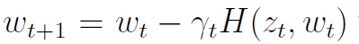
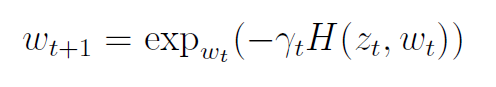
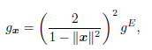
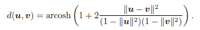
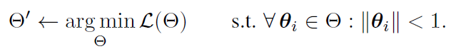
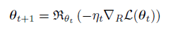
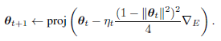

## [2013 - Stochastic gradient descent on Riemannian manifolds](https://ieeexplore.ieee.org/abstract/document/6487381/)

+ 贡献：we develop a procedure **extending stochastic gradient descent algorithms** to the case where the **function is defined on a Riemannian manifold**.

  + 介绍**general stochastic gradient descent algorithms** on Riemannian manifolds。可归类到本文提出的一般框架中去。
  + 分析**convergence** properties of the algorithms；
  + 应用示例applied to four examples。Oja algorithm（PCA）、

+ $R^N$里的标准SGD的不足：比如low-rank matrix estimation ( matrix completion）问题，如解决CF问题，方法是：is to constrain the state space by assuming the tastes of the users are explained **by a reduced number of criteria**(say, r). 则问题解为non-linear optimization problem；

  

  **但是求的解不能保证是rank r的** ，the updated matrix $W − γ_t∇W(W^*_{ij} − W_{ij})^2$ does not have rank r。解决办法是to enforce the rank constraint is to **endow the parameter space with a Riemannian metric**.

+ 黎曼流形里的SGD方法：参数w属于黎曼流形里，替代更新规则：其中

  

  其中$exp_{w_t}$为w点的exponential map函数。从黎曼流形映射到其切空间（欧几里得）。

+ 参数收敛：The parameter is proved to **converge almost surely to a critical point of the cost function** in various cases and under various conditions，以下两种情况之一，参数完全收敛。

  + when the parameter $w\in M$ is proved to remain in a **compact set**,

  + on specific non positively curved Riemannian manifolds，a slightly modified。具体请看文件。

未完，

## [2014 - SIGKDD - Deepwalk: Online learning of social representations](https://dl.acm.org/doi/abs/10.1145/2623330.2623732)

+ 思路：使用随机游走产生局部信息学习节点的潜在表示，uses **local information obtained from truncated random walks** to learn **latent representations** by **treating walks as the equivalent of sentences**。
+ 优点
  + local exploration is easy to **parallelize**. 
  + accommodate **small changes** in the graph structure **without the need for global recomputation**.
+ 方法：将随机游走产生的序列当作NLP里的句子，因此可以使用NLP里的：
  + **CBOW**：using the context to predict a missing word。
  + **SkipGram**：uses one word to predict the context。文章使用的方法。

## [2017 - Poincar\'e embeddings for learning hierarchical representations](https://arxiv.org/abs/1705.08039)

+ 动机：complex symbolic datasets often exhibit a latent **hierarchical structure**。比如power-law distributions in datasets（social and semantic
  networks） can often be traced back to hierarchical structures，

+ 贡献：introduce a new approach for **learning hierarchical representations of symbolic data by embedding them into hyperbolic space**（n-dimensional Poincaré ball）。

+ Poincaré Embeddings：

  + 定义各符号数据位于open d-dimensional unit ball：$B^d = \{x \in R^d |\ ||x|| < 1\}$空间中，equipped with the Riemannian metric tensor，

    

    其中$g^E$为欧几里得度量[1,……,1]。流形空间里两点的距离为：

    

  + 使用多维：

    1. **multiple latent hierarchies can co-exist**, which can not always be modeled in two dimensions. 
    2.  a larger embedding dimension can **decrease the difficulty** for an optimization method to find a good embedding。

  + 损失函数：$L(\Theta)$encourages semantically **similar objects to be close** in the embedding space according to **their Poincaré distance**。

    

+ 优化方法：使用黎曼流形里的随机梯度下降RSGD：

  
  
  最后使用的是：
  
  

具体推导看论文

## [2018 - NIPS - Hyperbolic neural networks](https://arxiv.org/abs/1805.09112)

+ 贡献：基于双曲空间的方法比欧几里得空间的少，是因为双曲空间中缺少了对应的hyperbolic neural network layers；generalize deep neural models to non-Euclidean domains 。**derive hyperbolic versions of important deep learning tools**（multinomial logistic regression (MLR), feed-forward (FFNN), simple and gated (GRU) recurrent neural networks (RNN)）。
+ 

### 2019 - iclr - Rotate Knowledge graph embedding by relational rotation in complex space

KG里面的关系：symmetry/antisymmetry, inversion, and composition

transE是对inversion, and composition的建模。无法对对称建模，因为对称关系会为0，对称关系的实体则表示相近。

建模方法：三元组（h,r,t），希望h=t*r，|r|<1；

三种关系间的联系：对称 r=1，反转r1,r2共轭，组合r1,r2组合成r3；

### 2019 - nips - Hyperbolic graph neural network

使用logarithmic map logx将节点映射到tangent space；

使用exponential map expx将节点映射回manifold

novel GNN architecture for learning representations on Riemannian manifolds with differentiable exponential and logarithmic maps.

将GCN推广到了Riemannian Manifolds；比较了三种Riemannian Manifolds GCN的性能：Euclidean Space、Poincaré Ball Model、Lorentz Model

### 2020 - Low-Dimensional Hyperbolic Knowledge Graph Embeddings

KG里的关系有：hierarchical and logical patterns

1. 为各种关系学习hyperbolic embeddings with relation-specific curvatures 
2. parameterize hyperbolic isometries获取关系逻辑模式
3. 使用hyperbolic attention组合多种逻辑模式。

### 2021 - www - HGCF Hyperbolic Graph Convolution Networks for Collaborative Filtering