# Disentangle

分离意图，解耦的方法，旨在使得embedding各维度尽可能表达不同的涵义，这样减少冗余，提高模型性能。

## [2017 - CVPR - Conditional similarity networks](http://openaccess.thecvf.com/content_cvpr_2017/html/Veit_Conditional_Similarity_Networks_CVPR_2017_paper.html)

目前方法存在的问题：在用距离度量两张图片的相似性时，images are only compared to **one unique measure of similarity**.（**整体相似性**）contradicting notions of similarities cannot be captured in a single space.

+ 方法：**learn embeddings differentiated into semantically distinct subspaces that capture the different notions of similarities**.a masking operation leading to separate semantic subspaces.

  + 学习一个映射函数$f(x)=Wg(x)$，使得图片的不相似性可以由$f(x)$间的距离表示。输入三元组：根据条件$c$（一种相似notion），比较图片$x_1,x_2,x_3$。{reference image, more distant image, closer image}。采样这样的三元组获得训练集

  + 损失函数：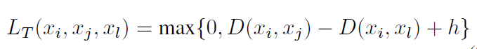

  + 为了学习条件相似：**introduce masks** $m$ over the embedding with $m\in R^{d×n_c}$ where **$n_c$ is the number of possible notions of similarities**。每一列对应一种相似概念，$m = \sigma(\beta)=max\{0,\beta\}$；通过学习选择合适的维度，masked distance function between two images：

    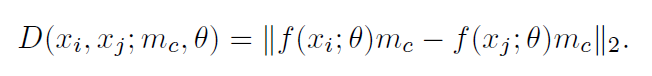

  + 加入正则项，使得embedding主要在单位球里。同时对mask也加正则项，

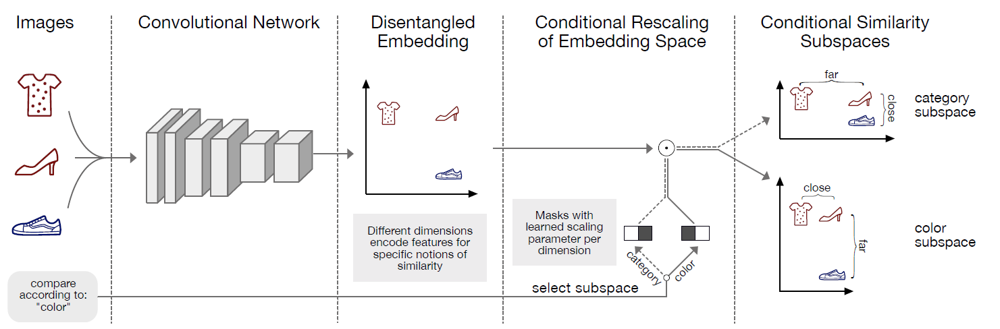

## [2020 - SIGIR - Disentangled Graph Collaborative Filtering](https://dl.acm.org/doi/abs/10.1145/3397271.3401137)

每一条交互背后的**意图**是不一样的

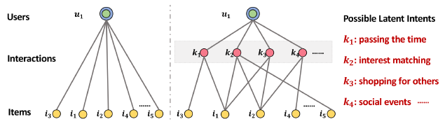

+ 方法：
  1. 将embedding分为很多块。每一块各独立表示一种意图。初始化，每一条边在各意图上的分布是均匀的，
  2. 用节点的邻域更新节点的表示，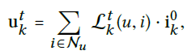
  3. 由更新的节点表示更新边在各意图上的分布。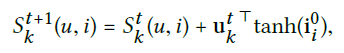
  4. 重复迭代2-3，使得分布收敛，为了获取高阶信息，堆叠多层这样的网络。
  5. 为了使每块尽可能表示不同的意图，添加了独立模块。**distance correlation**。

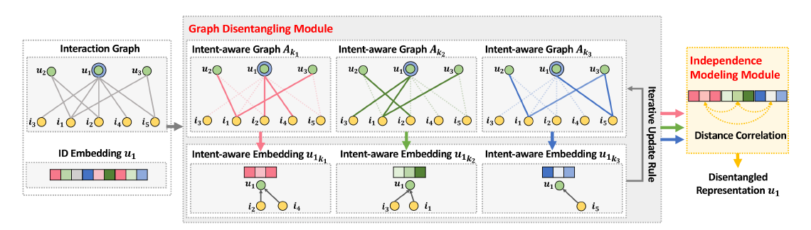

# Graph

## [2014 - SIGKDD - Deepwalk: Online learning of social representations](https://dl.acm.org/doi/abs/10.1145/2623330.2623732)

+ 思路：使用随机游走产生局部信息学习节点的潜在表示，uses **local information obtained from truncated random walks** to learn **latent representations** by **treating walks as the equivalent of sentences**。
+ 优点
  + local exploration is easy to **parallelize**. 
  + accommodate **small changes** in the graph structure **without the need for global recomputation**.
+ 方法：将随机游走产生的序列当作NLP里的句子，因此可以使用NLP里的：
  + **CBOW**：using the context to predict a missing word。
  + **SkipGram**：uses one word to predict the context。文章使用的方法。

## [2019 - SIGKDD - Kgat: Knowledge graph attention network for recommendation](https://dl.acm.org/doi/abs/10.1145/3292500.3330989)

**用户交互的物品，彼此之间有关系**；将物品的属性关系加入交互图中，hybrid structure of KG and user-item graph；

+ 之前的KG的方法：
  + path-based：依赖于定义的路径，需要专业知识。
  + regularization-based：没有解释性，无法保证long-range的连接。

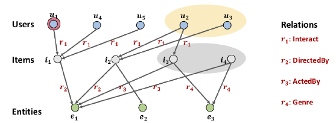

+ 方法：将GCN中的**recursive embedding propagation**和**attention-based aggregation**结合起来。

  1. 将用户和物品的交互当作一种关系，用户和物品当作实体，加入KG中。
  2. 使用TransR学习每种关系和实体embedding。
  3. 使用Attentive Embedding Propagation Layers学习高阶连接和结构信息；

  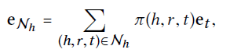

  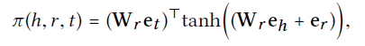

  4. 最后拼接每一层的embedding，用**点积**表示用户和物品的匹配程度。

# Simplify

GCN模型里堆叠的层数都很低。因为堆叠层数变多后会导致over-smooth问题，为了解决该问题，研究方法分为两种：

+ 简化，
+ 借鉴ResNet的方法，使用跳连接。

## [2020 - SIGIR - Lightgcn: Simplifying and powering graph convolution network for recommendation](https://dl.acm.org/doi/abs/10.1145/3397271.3401063)

**feature transformation** and **nonlinear activation** — contribute little to the performance of collaborative filtering.

+ 删掉GCN里的特征变换和非线性激活函数。使模型更简单，且性能更好。

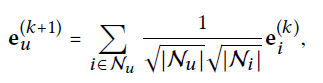

# Hyperbolic space

双曲空间相比欧氏空间能够更好地表示层次结构。

## [2013 - Stochastic gradient descent on Riemannian manifolds](https://ieeexplore.ieee.org/abstract/document/6487381/)

+ 贡献：we develop a procedure **extending stochastic gradient descent algorithms** to the case where the **function is defined on a Riemannian manifold**.

  + 介绍**general stochastic gradient descent algorithms** on Riemannian manifolds。可归类到本文提出的一般框架中去。
  + 分析**convergence** properties of the algorithms；
  + 应用示例applied to four examples。Oja algorithm（PCA）、

+ $R^N$里的标准SGD的不足：比如low-rank matrix estimation ( matrix completion）问题，如解决CF问题，方法是：is to constrain the state space by assuming the tastes of the users are explained **by a reduced number of criteria**(say, r). 则问题解为non-linear optimization problem；

  

  **但是求的解不能保证是rank r的** ，the updated matrix $W − γ_t∇W(W^*_{ij} − W_{ij})^2$ does not have rank r。解决办法是to enforce the rank constraint is to **endow the parameter space with a Riemannian metric**.

+ 黎曼流形里的SGD方法：参数w属于黎曼流形里，替代更新规则：其中

  

  其中$exp_{w_t}$为w点的exponential map函数。从黎曼流形映射到其切空间（欧几里得）。

+ 参数收敛：The parameter is proved to **converge almost surely to a critical point of the cost function** in various cases and under various conditions，以下两种情况之一，参数完全收敛。

  + when the parameter $w\in M$ is proved to remain in a **compact set**,

  + on specific non positively curved Riemannian manifolds，a slightly modified。具体请看文件。

未完，

## [2017 - Poincar\'e embeddings for learning hierarchical representations](https://arxiv.org/abs/1705.08039)

+ 动机：complex symbolic datasets often exhibit a latent **hierarchical structure**。比如power-law distributions in datasets（social and semantic networks） can often be traced back to hierarchical structures，
  
+ 贡献：introduce a new approach for **learning hierarchical representations of symbolic data by embedding them into hyperbolic space**（n-dimensional Poincaré ball）。

+ Poincaré Embeddings：

  + 定义各符号数据位于open d-dimensional unit ball：$B^d = \{x \in R^d |\ ||x|| < 1\}$空间中，equipped with the Riemannian metric tensor，

    

    其中$g^E$为欧几里得度量[1,……,1]。流形空间里两点的距离为：

    

  + 使用多维：

    1. **multiple latent hierarchies can co-exist**, which can not always be modeled in two dimensions. 
    2.  a larger embedding dimension can **decrease the difficulty** for an optimization method to find a good embedding。

  + 损失函数：$L(\Theta)$encourages semantically **similar objects to be close** in the embedding space according to **their Poincaré distance**。

    

+ 优化方法：使用黎曼流形里的随机梯度下降RSGD：

  
  
  最后使用的是：
  
  

具体推导看论文

## [2018 - NIPS - Hyperbolic neural networks](https://arxiv.org/abs/1805.09112)

+ 贡献：基于双曲空间的方法比欧几里得空间的少，是因为双曲空间中缺少了对应的hyperbolic neural network layers；generalize deep neural models to non-Euclidean domains 。**derive hyperbolic versions of important deep learning tools**（multinomial logistic regression (MLR), feed-forward (FFNN), simple and gated (GRU) recurrent neural networks (RNN)）。

未完

## [2019 - ICLR - Rotate: Knowledge graph embedding by relational rotation in complex space](https://arxiv.org/abs/1902.10197)

+ 贡献：present a new approach for knowledge graph embedding，to model and infer various **relation patterns** including: **symmetry/antisymmetry, inversion, and composition**。and a novel self-adversarial negative sampling technique。

  + 比如symmetry（e.g., marriage）、antisymmetric (e.g., filiation)；inverse of other relations (e.g., hypernym and hyponym); and some relations may be composed by others (e.g., my mother’s husband is my father).

+ 灵感来源：from Euler’s identity $e^{i\theta} = \cos\theta + i\sin\theta$，**unitary complex number can be regarded as a rotation in the complex plane**，复数的乘积可表示为：**相角相加，幅度相乘**

+ 方法：the RotatE model maps the entities and relations to the complex vector space and **defines each relation as a rotation from the source entity to the target entity**。Given a triplet ($h,r,t)$, we expect that $t = h \circ r$。

  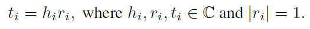

  三种关系间的联系可表示为：对称——$r=\pm 1$，反转——$r_1=\bar r_2$共轭，组合——$r_3=r_1\circ r_2$；

  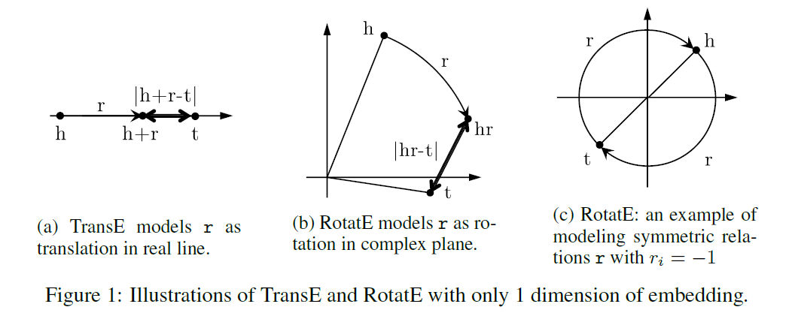

+ 与其他模型的比较：如transE是对inversion, and composition的建模。无法对对称建模，因为对称关系会为0，

  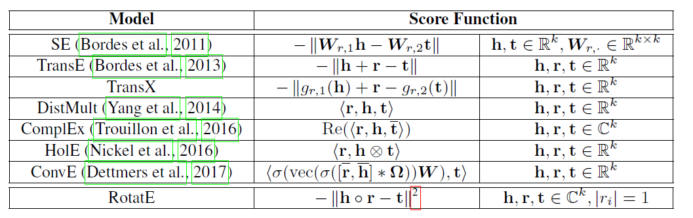

+ 优化：以前uniform的采样的缺点：since **many samples are obviously false as training goes on**, which does not provide any meaningful information.提出了self-adversarial negative sampling, samples negative triples according to the current embedding model.

  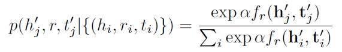

+ 损失函数：

  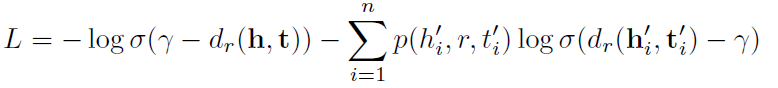

## [2019 -  NIPS - Hyperbolic graph neural networks](https://arxiv.org/abs/1910.12892)

+ 贡献：novel **GNN architecture for learning representations on Riemannian manifolds** with **differentiable exponential and logarithmic maps**.

  + 使用logarithmic map $\log_x$将节点映射到tangent space；
  + 使用exponential map $\exp_x$将节点映射回manifold

+ 方法：Since the **tangent space of a point on Riemannian manifolds always is Euclidean** (or a subset of Euclidean space), functions with trainable parameters are executed there. 

  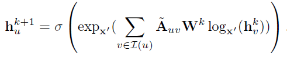

  + Euclidean Space：$\exp_x(v) = x + v$，$\log_x(y) = y - x$。

  + Poincaré Ball Model：

    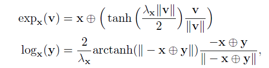

  + Lorentz Model：

    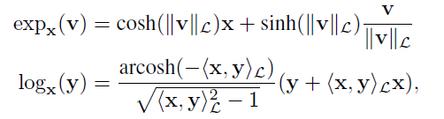

## [2019 - WWW - Tag2vec: Learning tag representations in tag networks](https://dl.acm.org/doi/abs/10.1145/3308558.3313622)

+ 之前network embedding的缺点：ignore the abundant semantic and hierarchical information of tags. 

+ 方法：mixes nodes and tags into a **hybrid network**，define semantic distance as the **proximity between tags**，use parameterized **random walk**, to generate **context with semantic and hierarchical information of tags** adaptively. use **hyperbolic Skip-gram model** to express the complex hierarchical structure better with lower output dimensions.

  + 定义标签的社区A Ground-truth Community $C_t$ is the **set of nodes labeled by tag t** ；然后用社区表示标签间的距离The distance between tags is defined by the **relationship between their groundtruth communities**. 

    + Member Similarity：the ratio of the common members to all members of two tag;
    + Social Closeness：the ratio of the **connected edges** between members of two ground-truth communities to all
      their **inter-connected edges**。

  + 使用标签间的信息产生上下文generate the **context** with both member similarity and social closeness information between tags.

    + 两种游走策略：MS-driven walk；SC-driven walk.

    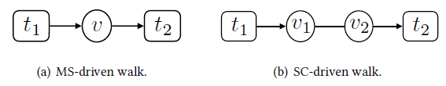

    + 要捕获到标签间的层次结构，**希望random walk包含标签间足够多的Transverse and Vertical Relationship信息**。the sizes of ground-truth communities可以反应这两种关系。可以通过上一次标签和当前标签进行size的比较，来控制一个序列中两种关系的比例和类别。
    
  + Hyperbolic Skip-Gram：用hyperbolic空间点表示节点的embedding。并使用skip-gram(单词预测环境)来表现标签间的关系。并使用RSGD优化。

##  [2021 - WWW - HGCF: Hyperbolic Graph Convolution Networks for Collaborative Filtering](http://www.cs.toronto.edu/~mvolkovs/www2021_hgcf.pdf)

+ 结合skip-GCN和hyperbolic space，并使用margin ranking loss进行学习。

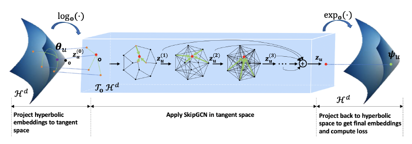

+ 方法：

  1. 使用Lorentz representation表示用户和物品：1）选定参考点origin，2）用multivariate Gaussian初始化表示，这些表示是在参考点的tangent space $T_oH^d$，3）使用$exp(v)$得到用户在Lorentz space的表示。
  2. 进行GCN，不能直接在Lorentz space上进行GCN，需要使用$log(v)$将其变换到tangent space，使用skipGCN学习高阶信息。最后再变回Lorentz space，

  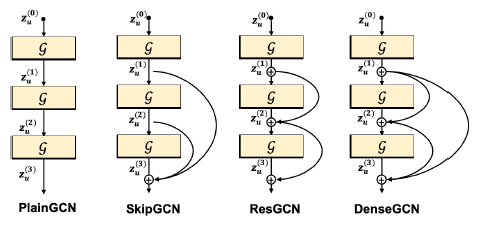

  3. 使用Hyperbolic **Margin Ranking Loss**作为损失函数，$d_L$为Lorentz space中的距离度量。使用RSGD进行优化。为了可视化，可将Lorentz space变为Poincaré space。

  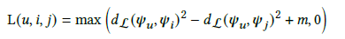

# Combination

## [2017 - AAAI - CLARE: A joint approach to label classification and tag recommendation](https://ojs.aaai.org/index.php/AAAI/article/view/10479)

统一post的tag推荐和label分类

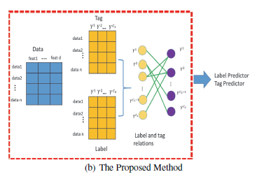

+ tag推荐和label分类可分别表示为：$\min \Omega(W_*) + L(XW_*,Y_*)$，$*$可为tag或label，将两者的变换矩阵W、输入矩阵、输出矩阵各自拼接起来。组成一个统一的框架。

+ tag与label的关系，两者的邻接矩阵$B\in R^{t\times c}$，如果出现在同一post中，则为1；将相连的label和tag纳入一个group。

  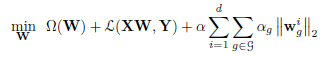

+ 设计了一个优化算法：还未看完，